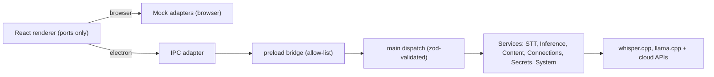

<div align="center">

# Khonjel

**A local-first, privacy-first desktop voice productivity app.**

Speak anywhere, and Khonjel transcribes, cleans up, and places the text right where you're working — running fully on **on-device, open-source models**, with optional cloud, self-hosted, and enterprise APIs.

[](https://www.electronjs.org/)
[](https://react.dev/)
[](https://www.typescriptlang.org/)
[](https://vite.dev/)
[](https://tailwindcss.com/)

[](https://github.com/prabinpebam/khonjel/releases/latest)

</div>

> **Khonjel** is Manipuri for *"Voice."* It works offline by default — your audio and transcripts never leave your machine unless *you* connect a cloud provider.

---

## Download

**[Download the latest release](https://github.com/prabinpebam/khonjel/releases/latest)** — a single portable `.exe` for **Windows 10/11 (x64)**. No installer: download `Khonjel-<version>-portable.exe` from the release assets and run it.

- If **Windows SmartScreen** appears on first run, choose **More info -> Run anyway** (the portable build is unsigned).
- Khonjel works immediately with a built-in fallback; open **Settings** to download the local whisper.cpp / llama.cpp engines for full on-device transcription and cleanup.

Browse [all releases](https://github.com/prabinpebam/khonjel/releases) for release notes and previous versions.

---

## Highlights

- **Floating dictation bar** — press a global hotkey anywhere, speak, and the cleaned-up text is pasted at your cursor. Live waveform and streaming partial text while you talk; capture → transcribe → clean up → inject, all on device.
- **On-device engines, one-click setup** — speech-to-text via [whisper.cpp](https://github.com/ggml-org/whisper.cpp) (or NVIDIA [Parakeet](https://github.com/k2-fsa/sherpa-onnx)), language cleanup + chat via [llama.cpp](https://github.com/ggml-org/llama.cpp). The app downloads the models **and** their engine binaries on demand — no account, no telemetry.
- **Optional GPU acceleration** — turn it on from Settings and Khonjel fetches a CUDA/Vulkan build for your card, verifies it on-device, and falls back to the CPU if anything fails. The base install stays small until you opt in.
- **Bring your own cloud (optional)** — Azure OpenAI and OpenAI-compatible providers, with API keys stored in your OS keychain (never in plaintext).
- **Productivity surfaces** — Home (history + stats), Chat, Notes with AI actions, Upload (transcribe audio files), a personal Dictionary, hotkey-bound Transforms, and Insights.
- **Typed IPC seam** — the same React UI runs on in-memory mock adapters in the browser and on the real Electron backend, with one allow-listed, schema-validated bridge between them.
- **Private + hardened** — offline by default, no telemetry, secrets and transcripts encrypted at rest, strict CSP, and a loopback-only model server. See [SECURITY.md](SECURITY.md).

## How dictation works

```text
 ┌── press hotkey ──┐         on device                       at your cursor
 │                  ▼                                                 ▲
 You speak ──▶ Floating bar ──▶ whisper.cpp (STT) ──▶ llama.cpp (cleanup) ──▶ paste
```

The floating bar is an always-on-top, **non-focusable** window, so it never steals focus from the
app you're typing into — the cleaned text lands exactly where your cursor was.

## Quick start

> Requires **Node.js 20+** and **Windows** (text injection + window control use the Win32 layer today). All commands run from the [`app/`](app) folder.

```bash
cd app
npm install --legacy-peer-deps

# Build and launch the desktop app
npm run electron
```

On first launch, open **Settings → Speech-to-Text** and click **Download recommended setup** —
Khonjel fetches the speech + language models **and** their engine binaries for you. Prefer the CLI, or
setting up a dev machine? Fetch them ahead of time instead:

```bash
npm run fetch:whisper    # whisper.cpp + a ggml STT model
npm run fetch:llama      # llama.cpp server + a small GGUF LLM (~1 GB)
npm run fetch:parakeet   # (optional) NVIDIA Parakeet STT via sherpa-onnx
```

Prefer to explore the UI without a backend? Run the renderer in the browser against mock adapters:

```bash
npm run dev            # http://localhost:5173 — fully interactive, fake data
```

If the local engines aren't downloaded, the app still runs: dictation cleanup falls back to a
deterministic stub, and transcription reports `model_unavailable` until a model is present.

## Using a cloud provider (optional)

Khonjel is fully usable offline. To route a task to the cloud instead:

1. **Settings → Connections** → add a provider (e.g. Azure OpenAI or any OpenAI-compatible endpoint). The API key is stored in the OS keychain via Electron `safeStorage`.
2. **Settings → Speech-to-Text** / **Language Models** → choose **Enterprise** mode and bind the connection + deployment.

Local and cloud share one model picker per task — change it once and it's reflected everywhere.

## GPU acceleration (optional)

Khonjel runs on the CPU out of the box. To go faster, open **Settings → Speech-to-Text → GPU
acceleration** and click **Turn on**: it detects your card, downloads a matching build, and verifies
it actually runs before switching over.

- **Cascades to what works** — tries CUDA first, then Vulkan, then stays on the CPU floor, so a
  missing or incompatible build never dead-ends you.
- **Both engines** — accelerates dictation (whisper) and cleanup/chat (llama) from one switch.
- **Honest + reversible** — an on-device speed check shows the real before/after, and one click turns
  it back off.

The base install stays small because GPU builds are only downloaded if you opt in.

## Architecture

The renderer imports only service **ports** (`@services`). A single composition root binds those
ports to either mock adapters (browser) or the real IPC adapter (Electron), so the shipping UI never
changes when the backend does.



- **Native engines as child processes** — whisper.cpp / llama.cpp run as standalone executables the
  main process spawns and talks to over HTTP/stdio. This sidesteps the Electron/Node native-ABI
  problem entirely (no native node modules to rebuild).
- **One bridge, validated** — every call crosses a single `khonjel:invoke` channel that checks a
  contract version and validates the channel + payload with zod before dispatch.
- **Settings as data** — flat, dotted-key settings persist to a JSON file in `userData` and mirror
  into the renderer store, so the UI binds generically and the backend reads per-slot.

## Project structure

```text
app/
  electron/
    main/            # main process: services, inference/STT runtimes, injection, hotkeys
    shared/          # pure IPC seam: contract + zod schemas + dispatch
    store/           # durable JSON stores + migrations
  src/
    surfaces/        # control panel, settings, command palette, floating bar
    features/        # home, chat, notes, upload, dictionary, transforms, insights
    services/        # ports + mock/ipc adapters (the seam)
    stores/ hooks/ lib/ components/   # Zustand stores, hooks, utils, design-system UI
  eval/              # eval-driven-development scenarios (browser + electron)
  scripts/           # build, model fetchers, icon generation
docs/                # product spec + engineering frameworks
```

## Development

```bash
npm run verify:quick   # typecheck + eslint + design-system lint + unit tests (inner loop)
npm run verify         # verify:quick + production build
npm run test           # Vitest unit tests
npm run eval           # browser EDD (Playwright vs Vite)
npm run eval:electron  # eval-driven validation against the real Electron app
npm run package        # build a portable Windows .exe (electron-builder)
```

Khonjel is built **test-first and eval-driven**: pure logic is unit-tested, and user-visible
behavior is gated by Playwright scenarios — including ones that launch the **real Electron app** and
drive it end to end (the floating bar, model selection, and system settings each have one).

## Privacy & security

- **Offline by default.** Audio is captured, transcribed, and cleaned up locally; nothing is uploaded.
- **No telemetry.** There is no analytics or tracking.
- **Keys stay in the keychain.** Cloud API keys are encrypted via the OS keychain, never written in plaintext, and never exposed to the renderer.
- **Encrypted at rest.** Transcripts and notes are encrypted on disk, and the local model server is bound to loopback with a per-session token.
- **Hardened renderer.** Strict CSP, navigation lock, and a single allow-listed, schema-validated IPC bridge. Full threat model in [SECURITY.md](SECURITY.md).

## Tech stack

Electron 42 · React 19 · TypeScript (strict) · Vite 8 · Tailwind CSS v4 · Zustand · zod ·
better-sqlite3 · Vitest · Playwright · whisper.cpp · llama.cpp · sherpa-onnx.

## Credits

Khonjel is a local-first, de-monetized app modeled on the open-source
[OpenWhispr](https://github.com/OpenWhispr/openwhispr) (MIT) — same core stack and on-device
philosophy — with additional productivity polish. Local inference is powered by the excellent
[whisper.cpp](https://github.com/ggml-org/whisper.cpp), [llama.cpp](https://github.com/ggml-org/llama.cpp), and [sherpa-onnx](https://github.com/k2-fsa/sherpa-onnx) projects.
