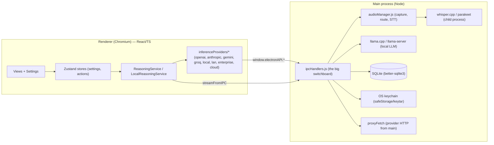

# Benchmark 00 — OpenWhispr (architecture reference)

> Source: `github.com/OpenWhispr/openwhispr` (MIT). **Electron** desktop app, TypeScript/React
> renderer + Node main process. Multi-purpose voice productivity (dictation, voice agent,
> notes, meetings, chat). **This is Khonjel's closest analog and architectural template.**

This document captures *how OpenWhispr is built* from a source review, so we can adopt the
good parts and improve the rest. All code references are to the repo above.

---

## 1. Process & module model

Electron's standard split, used deliberately:



**Key idea:** the renderer holds the *orchestration* logic (which provider, which prompt,
routing), but anything that needs Node — file system, child processes (whisper/llama),
keychain, raw HTTP to providers (to avoid CORS and to keep keys out of the page) — is an
**IPC call into the main process**. `proxyFetch` in main performs the actual provider HTTP.

> **Lesson for Khonjel:** this is exactly our `@services` ports/adapters seam, but
> OpenWhispr's seam is *informal* (scattered `window.electronAPI.*` + dynamic imports).
> Khonjel formalizes it (one typed ports interface, one adapter set). See [03](03-khonjel-backend-architecture.md).

## 2. The text-intelligence services

Three layers, found under `src/services/`:

- **`BaseReasoningService`** — shared base. Owns `getSystemPrompt(agentName)` (delegates to
  `getCleanupSystemPrompt`), `getCustomDictionary()`, `calculateMaxTokens(len, min, max, mult)`
  (`max(100, min(len*2, 2048))`), preferred/UI language.
- **`ReasoningService`** — cloud + streaming + **tool-calling agent** (uses the Vercel `ai`
  SDK; `MAX_TOOL_STEPS = 20`). `processText`, `processTextStreaming`, `processTextStreamingAI`.
  Holds a `SecureCache<string>` of API keys and a per-stream `AbortController`.
- **`LocalReasoningService`** — on-device llama.cpp path (default model id e.g.
  `qwen2.5-7b-instruct-q5_k_m`).

**Provider registry** — `src/services/ai/inferenceProviders/` is a clean strategy pattern:

```ts
export interface InferenceProvider { readonly id: string; call(p: ProviderCallParams): Promise<string> }
// PROVIDER_REGISTRY = { openai, custom→openai, anthropic, gemini, groq, local,
//                       bedrock→enterprise, azure→enterprise, vertex→enterprise, openwhispr, lan }
```

Each provider receives a `ProviderContext` (`getApiKey`, `getSystemPrompt`, `getCustomDictionary`,
`callChatCompletionsApi`, `calculateMaxTokens`). OpenAI/Groq/LAN funnel through one
`callChatCompletionsApi`; Anthropic/Gemini/enterprise have their own request shapes (Anthropic
is built in the **main process** via `proxyFetch` to keep the key off the page).

> **Default inference config** (`InferenceConfigManager.getDefaultConfig`): `temperature 0.3`,
> `maxTokens 512`, `topK 40`, `topP 0.9`, `repeatPenalty 1.1`, `contextSize 2048`, `timeout 30s`.
> These are good Khonjel defaults for **cleanup**; chat/agent want higher maxTokens.

## 3. Capture → text routing

`audioManager.js` (`resolveReasoningRoute`) decides what to do with a fresh transcript:

```text
cleanupReachable = useCleanupModel && (cleanupModel set || cloud cleanup)
agentReachable   = useDictationAgent && agentModel set
agentInvoked     = agentName present AND detectAgentName(text, agentName)
route = agent | cleanup | skip       // detectAgentName drives "instruction mode"
```

So a single dictation can become either **cleaned text** (default) or an **agent command**
— decided by whether the user *addressed the agent by name* in their speech
(`detectAgentName`). This is the crux of "instruction mode."

## 4. Prompt engineering (the part that makes it effective)

OpenWhispr's prompts live in `src/config/prompts/` + locale bundles `src/locales/<lang>/prompts.json`.
The system is **i18n-first and override-friendly**:

- **`PROMPT_KINDS`** = `cleanup` (`cleanupPrompt`), `dictationAgent` (`fullPrompt`), `chatAgent`
  (a hardcoded fallback). Note formatting/meeting prompts live separately (see below).
- **`resolvePrompt(kind, opts)`** = `customPrompt || i18n(kind)` → `applySubstitutions`:
  - replaces `{{agentName}}` with the user's wake word (default "OpenWhispr"),
  - appends a **language instruction** (`getLanguageInstruction`),
  - appends a **dictionary suffix** + the user's custom dictionary words
    (`appendDictionarySuffix`) so jargon survives cleanup.
- **Per-purpose `disableThinking`** flags strip reasoning tokens for speed.
- **`PromptStudio`** lets users View / Customize / Test each prompt; customs persist per kind.

> ⚠️ **Paraphrased, not quoted.** The shapes below paraphrase the *intent* of OpenWhispr's
> prompts from a source review — **not** verbatim text. Re-read the actual source files
> before relying on exact wording. (OpenWhispr is MIT; Khonjel ships its own prompts in [05](05-prompt-library.md).)

- **Chat agent default:** a concise, conversational voice assistant that handles informal
  phrasing gracefully.
- **Note enhancement (`BASE_SYSTEM_PROMPT`):** a note-enhancement assistant that outputs clean
  Markdown under strict format rules (no preamble, no tables/quotes, keep it brief).
- **Meeting notes (`MEETING_SYSTEM_PROMPT`):** consumes a dual-speaker transcript (`You:` /
  `Them:`) plus manual notes and emits actionable markdown.
- **Agent tools** (`getAgentSystemPrompt`) injects per-tool one-liners for
  `search_notes / get_note / create_note / list_folders / web_search / get_calendar_events /
  copy_to_clipboard`, plus optional note context (RAG).

> **Lesson:** the "cleanup" prompt is a *cleanup + instruction-detection* prompt — it both
> tidies text and obeys spoken instructions addressed to `{{agentName}}`. Khonjel keeps this
> dual role and the placeholder/dictionary/language machinery. Our own prompts: see [05](05-prompt-library.md).

## 5. Models, providers, storage

- **Model registry** — `ModelRegistry.ts` + `modelRegistryData.json`. Local STT (Whisper sizes,
  Parakeet), cloud STT (OpenAI, Groq, xAI, Mistral, Corti, AssemblyAI, Deepgram), LLM providers
  + enterprise (Bedrock/Azure/Vertex). `getModelProvider(modelId)` infers provider from id.
- **Settings** — one big Zustand store, persisted to `localStorage`, split into typed slices
  (Transcription/Cleanup/Hotkey/Microphone/ApiKey/Privacy/Theme/ChatAgent). API keys cached in a
  `SecureCache` and stored in the OS keychain.
- **Snippets & dictionary** — `expandSnippets` (single-pass trigger→text), `getDictionaryHintWords`
  feed both the **STT keyterms/word-boost** and the **cleanup dictionary suffix**.
- **Persistence** — transcriptions/notes in SQLite (main process); audio files on disk with a
  retention window; model cache under `~/.cache/openwhispr`.

## 6. The five inference modes

`openwhispr` (managed cloud, gated as "Pro"), `providers` (BYO key), `local` (llama.cpp),
`self-hosted`/`lan` (OpenAI-compatible server, auto-detected via `/v1/models`), `enterprise`
(Bedrock/Azure/Vertex). Each of the **4 LLM purposes** (cleanup, dictationAgent, noteFormatting,
chatAgent) selects its mode independently.

---

## 7. Pros & cons

### Strengths (adopt)
- ✅ **Cross-platform Electron** with a clean renderer/main split — matches Khonjel exactly.
- ✅ **Strategy-pattern provider registry** — trivial to add a provider; one `call()` contract.
- ✅ **Universal modes** (local / BYO / self-hosted / enterprise / cloud) already designed.
- ✅ **Prompt system**: i18n + `{{agentName}}` + dictionary suffix + per-kind override + Prompt Studio.
- ✅ **Instruction detection** (`detectAgentName`) cleanly splits dictation vs command.
- ✅ **Keys in keychain, provider HTTP proxied from main** (keys never in the page).
- ✅ Snippets/dictionary feed *both* STT and cleanup — consistent jargon handling.

### Weaknesses (improve in Khonjel)
- ⚠️ **Orchestration lives in the renderer** (dynamic `import()` of services, scattered
  `window.electronAPI.*`). The seam is implicit. → **Formalize one typed ports interface.**
- ⚠️ **`ipcHandlers.js` is a monolith** (thousands of lines). → **Split into per-domain handler modules.**
- ⚠️ **Settings persisted to `localStorage`** (renderer) — fine for prefs, weak for a source of
  truth. → **Move durable settings to the main process (SQLite/JSON), mirror to the renderer.**
- ⚠️ **No deterministic pre-clean / skip heuristic** — every cleanup hits the LLM. → **Adopt
  FreeFlow's regex+skip stages** (big latency/cost win; see [01](01-benchmark-freeflow.md)).
- ⚠️ **JS in the main process** (`.js`, looser typing). → **TypeScript end-to-end.**
- ⚠️ "OpenWhispr Cloud" is **gated/Pro**. → Khonjel **ungates everything**; cloud is optional & free.

> **Net:** Khonjel = OpenWhispr's *structure*, with a **formal seam**, **TS everywhere**,
> **main-process settings**, and **FreeFlow's pipeline** bolted into the cleanup path.
