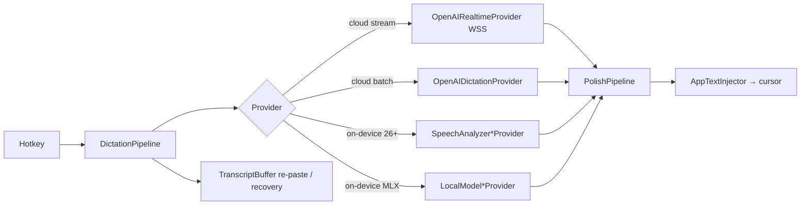

# Benchmark 01 — FreeFlow (pipeline reference)

> Source: `github.com/mrinalwadhwa/freeflow` (open source). **Native macOS app, Swift.**
> Single-purpose: *press a hotkey, dictate, polished text appears at the cursor in any app.*
> **Not** our app architecture (it is macOS-only Swift, not Electron) — but its **dictation
> pipeline is best-in-class** and is the template for Khonjel's text path.

This document captures the parts worth copying. Code references are to the repo above.

---

## 1. Shape of the app

- **`FreeFlowKit`** — a Swift Package (the engine: providers, engines, pipeline, prompts).
- **`FreeFlowApp`** — the macOS app shell (`AppDelegate`, HUD, onboarding HTML, menu bar).
- **No server.** Audio/transcripts go **directly** to OpenAI with the user's key, or run
  **fully on-device**. Keys live in the macOS Keychain.
- **Two modes** (`DictationMode`): `cloud` (OpenAI) and `local` (on-device, Apple Silicon, English-only).

**Protocol-oriented.** `DictationProviding` (batch) and `StreamingDictationProviding`
(stream) are tiny protocols; every provider implements one. The pipeline depends only on the
protocol, so providers (cloud/on-device) are swappable — *the same idea as our ports/adapters seam.*

## 2. The polish pipeline (the crown jewel)

`PolishPipeline` is a **three-stage, LLM-optional** transform from raw STT to clean writing:

1. **Deterministic dictated-punctuation substitution** — regex rules map spoken commands
   ("period", "comma", "new paragraph") to characters. Protected symbols are wrapped in
   `<keep>` tags so the LLM doesn't touch them; tags are stripped after.
2. **Clean-transcript skip heuristic (`isClean`)** — if the transcript already starts with a
   capital, ends with sentence punctuation, has no filler words and no repeated phrases, the
   LLM step is **skipped entirely**. FreeFlow's own `BENCHMARK.md` reports that **the large
   majority of dictations take this fast path** (their self-reported figure, ~80%+; not
   independently verified here).
3. **LLM refinement** — a *single* small-model chat completion removes fillers, fixes
   repetitions, formats lists/numbers, adjusts tone. **On failure it falls back** to the
   deterministically-cleaned text (never blocks the user).

> This ordering — **cheap-deterministic → skip-if-clean → LLM-only-when-needed → graceful
> fallback** — is the single most valuable idea to import. It cuts median latency and cost
> dramatically and makes the LLM optional rather than on the critical path.

**Tone via context.** An `AppContext` (app name, window title, bundle id, focused-field
content) yields a light tone signal: the prompt is told to *"keep email formal, chat casual,
code comments technical… but do not over-adapt."* Tone is a hint, not a rewrite directive.

## 3. Streaming & latency engineering

`OpenAIRealtimeProvider` (the default cloud path) is a masterclass in perceived latency:

- One **persistent WebSocket** per dictation (`wss://api.openai.com/v1/realtime`), transcription-only.
- **Warm backup connection** pre-opened in the background after each session → the *next*
  dictation skips the connection handshake (FreeFlow reports most sessions see ~0 ms setup;
  self-reported).
- **Non-blocking start**: `startStreaming` returns immediately; audio forwarding begins as the
  HUD shows "listening."
- **Parallel batch fallback**: a `POST /v1/audio/transcriptions` runs alongside the socket;
  whichever finishes first wins, so a mid-session socket error is invisible.
- Result: FreeFlow reports a **sub-second median (≈0.55 s)** from key-release to text at cursor.
  *These are their cloud-realtime numbers; Khonjel's local-first path will differ and must be
  measured independently — do not assume they transfer.*

## 4. On-device stack (Apple Silicon)

- **STT:** `ParakeetEngine` — NVIDIA Parakeet TDT 0.6B v3 as **four CoreML models**
  (preprocessor → encoder → decoder → joint), run on the Neural Engine, 15 s windows.
  Also `SpeechAnalyzer`/`SFSpeechRecognizer` (macOS 26) for OS-native on-device STT.
- **LLM polish:** `MLXLLMEngine` — a fine-tuned **Qwen3 0.6B** (4-bit) via **MLX**, with a
  **LoRA adapter** trained specifically for dictation polish. Also `FoundationModelChatClient`
  (Apple's on-device ~3B model). The "four constants" (`realtimeModel`, `sttModel`, `model`,
  `polishModel`) are the only knobs for the whole AI pipeline.

> **Lesson:** a *tiny, task-specialized* polish model (0.6B + LoRA) beats a big general model
> for this job — fast, private, cheap. Khonjel's local cleanup should target small instruct
> models (Qwen 0.6–4B class) and, later, a fine-tuned cleanup adapter.

## 5. Text injection & recovery

- **`AppTextInjector`** picks an injection strategy **per target app bundle id**
  (`.pasteboard` / `.keystroke` / `.accessibility`) — e.g. pasteboard for Slack/Notion,
  keystroke for VS Code/terminal. This per-app table is hard-won knowledge.
- **`TranscriptBuffer`** keeps the last transcript for **"paste last"** and **no-target
  recovery** (if injection fails, the text survives for re-paste) — without touching the clipboard.

## 6. Prompts

Prompts are **per-language** Swift constants (`Prompts/PolishPrompt<Lang>.swift`,
`systemPromptLocal`, `systemPromptTamil`, …).

> ⚠️ **Paraphrased, not quoted.** The descriptions below paraphrase the *intent* of FreeFlow's
> prompts from a source review — **not** verbatim text. Re-read the actual source files before
> relying on exact wording. Khonjel ships its own prompts ([05](05-prompt-library.md)).

- **Role:** a speech-to-text cleanup assistant that turns a raw transcription into polished
  written text, followed by a numbered list of fixes (fillers, repetitions, dictated
  punctuation, numbers).
- **Output discipline (the key pattern):** return the text unchanged if it is already clean;
  no preamble, no surrounding quotes; return only the cleaned text.
- **Tone** comes from `AppContext` (formal/casual/technical) and is explicitly secondary to the
  cleanup rules.

> **Lesson:** strict **output discipline** (only the cleaned text, no preamble/quotes, unchanged
> if already clean) is what makes a cleanup prompt safe on the critical path. Khonjel adopts the
> *pattern*, with its own wording in [05](05-prompt-library.md).

---

## 7. Pros & cons

### Strengths (adopt the ideas)
- ✅ **3-stage polish pipeline** (regex → skip heuristic → LLM, with fallback) — latency, cost, robustness.
- ✅ **`isClean` skip heuristic** — FreeFlow reports the large majority of cleanups avoid the LLM.
- ✅ **Warm-connection + parallel-fallback** streaming — low perceived latency.
- ✅ **Context-as-tone-hint** (app/window/field) without over-adapting.
- ✅ **Small specialized local models** (Parakeet 0.6B + Qwen3 0.6B/LoRA) beat big general ones here.
- ✅ **Per-app injection strategy table** + **transcript buffer recovery**.
- ✅ **Output discipline** in the cleanup prompt.
- ✅ Genuinely **no server** in the path — a clean privacy story.

### Weaknesses / why it is *not* our architecture
- ❌ **macOS-only, Swift/MLX/CoreML** — not portable; Khonjel must be cross-platform Electron.
- ❌ **Single-purpose** (dictation only) — no notes, chat, meetings, transforms, dictionary UI, history.
- ❌ **OpenAI-centric** — one cloud provider; no BYO-provider matrix, no self-hosted/enterprise.
- ❌ **English-only on-device**; cloud needed for other languages.
- ❌ No multi-window control panel, no persistence layer beyond a transcript buffer.

> **Net:** FreeFlow is the wrong *app* shape for Khonjel but the right *pipeline*. We port its
> polish stages, latency tricks, injection table, and output discipline **into** OpenWhispr's
> cross-platform, multi-purpose, multi-provider Electron structure.
