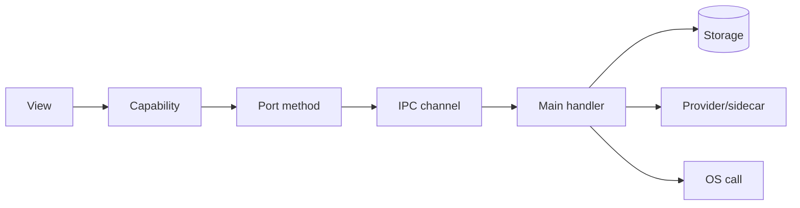

# 06 — Feature → backend coverage framework

> The **systematic method** for guaranteeing every frontend feature is completely backed by
> the backend. It defines: the *unit* of coverage, the *contract template* each feature gets,
> the *process* to drive a feature from mock → real, and the *exit criteria*. The filled-in
> result is [07 coverage matrix](07-feature-coverage-matrix.md).

---

## 1. Principle: the seam is the checklist

Because the renderer only talks to `@services` ports, **"covered" has a precise meaning**:

> A frontend feature is **covered** when every port method it calls is implemented by a real
> `ipc` adapter (not mock), backed by a main-process handler, with storage/providers wired,
> and its acceptance checks pass.

So coverage = *replace mock adapters with real ones, one port method at a time, until no
view depends on mock data.* The matrix tracks exactly that.

## 2. Unit of coverage: the "feature capability"

We decompose each view into **capabilities** — the smallest user-meaningful action or data
need. Examples: "Home shows recent history", "Notes: create note", "Dictation: cleanup runs",
"Settings ▸ STT: list local models". Each capability maps to **one or more port methods**.



## 3. The per-feature contract template

Every capability gets one row in the matrix and, when non-trivial, a short **contract block**
using this template (kept in the relevant contract doc 08–12):

```md
### Capability: <view> — <capability>
- **Port method(s):** ContentService.notes() / NotesService.create(...)
- **IPC channel(s):** content:notes (invoke) ; notes:create (invoke) ; notes:changed (event)
- **Request → Response types:** (link to shared/ types)
- **Storage:** tables touched + read/write
- **Provider/sidecar:** none | STT slot | LLM slot(kind)
- **OS calls:** none | injector | hotkey | clipboard
- **Privacy/egress:** local-only | provider egress (which) | opt-in gate
- **Errors:** structured error cases the UI must render
- **Acceptance:** the observable check that proves it's done
- **Tests:** the level(s) from §3a that gate it (e.g. BE1 handler unit + BE4 offline E2E)
```

## 3a. Backend test taxonomy (extends the frontend L0–L6)

The existing [validation strategy](../06-test-and-validation-strategy.md) defines **L0–L6** for
the *renderer* (tsc, ds-lint, RTL, axe, visual, spec-coverage, agent review). The backend adds
four levels; a backend capability is "done" only when its required BE levels pass:

| Level | Backend test | Proves |
|---|---|---|
| **BE1** | Handler/unit (Vitest, Node) | pure logic: pipeline stages, `isClean`, prompt resolution, insights math, migrations |
| **BE2** | IPC contract test | every channel's payload validates (zod), types match `shared/`, errors are structured `IpcError` |
| **BE3** | Adapter parity | `mock` and `ipc` satisfy the *same* `Services` interface for the method (type-level + a shared behavioral suite) |
| **BE4** | Offline E2E | the capability works end-to-end in a packaged build with **no network** (hot path), incl. cancel/error paths |

> Capability→level defaults: read methods → BE1+BE3; mutations → BE1+BE2+BE3;
> capture/inference/inject (hot path) → BE1+BE2+BE4; provider/egress → BE2 + a contract test
> with a stubbed endpoint. Each capability's **Tests** field names its exact set.
>
> **BE4 is an [Eval Driven Development](../../../frameworks/eval-driven-development/README.md)
> scenario** — a real-app run captured and judged by the eval harness
> ([`app/eval/`](../../../../app/eval/)), not a mock.

## 4. The process (mock → real, repeatable)

For each capability, in priority order (hot path first):

1. **Locate the call site** — find where the view calls the port (`useServices()`); confirm
   the mock return shape. This shape is the *contract the UI already expects*.
2. **Freeze the type** — move/confirm the request+response types in `shared/`. The mock and
   the real adapter must satisfy the *same* TypeScript interface.
3. **Write the IPC channel** — add the entry to `shared/ipc-contract.ts`; allow-list it in
   preload; add the typed method to the `ipc` renderer adapter.
4. **Implement the handler** — in the matching `electron/ipc/handlers/*` module; wire storage
   / inference / OS; validate the payload with zod at the boundary.
5. **Swap the adapter** — for that method, `ipc` now returns real data; the view is unchanged.
6. **Verify acceptance** — run the capability's observable check **and its required BE levels
   (§3a)**; confirm offline behavior and error rendering.
7. **Mark the matrix row** `Implemented`, record the **Test** level(s) passed, and tick the box.

> **Parity rule:** a capability is never "half real." Until step 6 passes it stays `Mock`, so
> the matrix is always an honest picture.

## 5. Phasing (drive order)

Cover in this order so the product is usable at every step:

| Phase | Theme | Capabilities |
|---|---|---|
| **0** | Seam proof | `profile:get`, `system:*` real; mock everything else |
| **1** | Hot path | Dictation capture → pipeline → inject → history append |
| **2** | Settings source-of-truth | Settings read/patch in main; STT/LLM slots; hotkeys |
| **3** | Models | Catalog, download, cache, hardware probe |
| **4** | Content surfaces | History, Notes, Dictionary, Snippets, Transforms, Upload |
| **5** | Intelligence surfaces | Voice Agent, Chat, Note formatting, Transforms run |
| **6** | Meetings | Detection, dual-channel capture, meeting notes |
| **7** | Integrations & search | Calendar/IDE, semantic search |
| **8** | Account/Workspace (optional) | Auth, sync — compile-out by default |

## 6. Governance: keeping coverage honest

- **Single source of truth:** the matrix ([07](07-feature-coverage-matrix.md)) is updated in
  the same change that implements a capability. PRs that add a view capability must add/extend
  a matrix row.
- **No orphan ports:** every port method appears in the matrix; every matrix row names a real
  view call site.
- **No silent mock fallback in production:** the `ipc` adapter must *not* fall back to mock at
  runtime; a missing handler is a visible error, not fake data.
- **Definition of done (whole backend):** every matrix row is `Implemented` and its acceptance
  box is ticked, with the hot path verified fully offline.

## 7. Acceptance (of the framework itself)
- [ ] Every view is decomposed into capabilities, each mapped to ≥1 port method.
- [ ] Each capability has a contract row; non-trivial ones have a contract block in 08–12.
- [ ] The 8-phase order is followed; the product runs at the end of every phase.
- [ ] The matrix is updated in lockstep with implementation; no orphan ports, no mock fallback.
