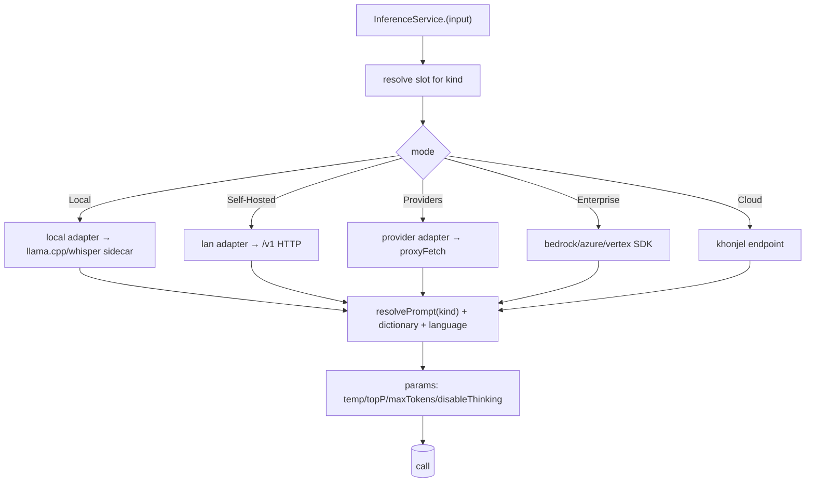

# 10 — Providers & models

> The inference layer: the **five modes**, the **six config slots**, the **provider registry**
> (strategy pattern from OpenWhispr), STT/LLM model catalogs, config resolution, and the
> latency engineering ported from FreeFlow. Implements `InferenceService`/`ModelCatalogService`
> from [08](08-ipc-and-ports-contracts.md).

---

## 1. Five inference modes

| Mode | What it is | Transport | Auth | Egress |
|---|---|---|---|---|
| **Local** | bundled engines on-device | in-proc / sidecar | — | none |
| **Self-Hosted / LAN** | user's OpenAI-compatible server (Ollama, LM Studio, vLLM) | HTTP `POST /v1/...`, discover via `GET /v1/models` | optional Bearer | user's LAN |
| **Providers (BYO key)** | OpenAI/Anthropic/Gemini/Groq/Deepgram/xAI | provider SDK/HTTP via `proxyFetch` | API key (keychain) | that provider |
| **Enterprise** | Bedrock / Azure OpenAI / Vertex | cloud SDK | account creds | that cloud |
| **Khonjel Cloud** *(optional, free)* | optional managed endpoint | HTTPS | account token | Khonjel endpoint |

> **Default is Local.** Cloud is never required and never gated/paid (contrast OpenWhispr's
> "Pro" cloud). Each of the six slots picks its own mode independently.
>
> **Azure OpenAI and every endpoint-style provider are configured as _connection profiles_
> (§3a) — endpoint, deployment, api-version, and auth are all user data; nothing is hardcoded.**

## 2. Six config slots

```ts
type SlotId = "STT.dictation" | "STT.note" | "LLM.cleanup" | "LLM.agent" | "LLM.note" | "LLM.chat";
interface SlotConfig {
  mode: Mode;                  // local | self-hosted | providers | enterprise | cloud
  connectionId?: string;       // cloud/self-hosted: → a ConnectionProfile (§3a)
  target: string;              // local: model file id · azure: deployment name · else: model id
  params?: InferenceParams;    // temperature/topP/maxTokens/disableThinking
}
```

A slot fully determines *what runs* for a purpose. Example defaults:

| Slot | Default mode | Default model | Notes |
|---|---|---|---|
| STT.dictation | Local | whisper-small / parakeet | hot path; fast model |
| STT.note | Local | whisper-medium | accuracy over speed |
| LLM.cleanup | Local | small instruct (Qwen 0.6–4B class) | runs only when `isClean` fails |
| LLM.agent | Local→Provider | mid instruct | tool-calling; reasoning on |
| LLM.note | Local | small instruct | note/meeting formatting (store key `llm.note`) |
| LLM.chat | Local→Provider | mid instruct | conversational |

## 3. Provider registry (strategy pattern)

```ts
interface InferenceProvider {
  readonly id: string;
  transcribe?(audio: AudioRef, cfg: SttConfig, ctx: ProviderContext): Promise<Transcript>;
  complete?(req: CompleteRequest, ctx: ProviderContext): AsyncIterable<string> | Promise<string>;
  listModels?(endpoint: string, ctx: ProviderContext): Promise<ModelInfo[]>;
}
const PROVIDERS: Record<string, InferenceProvider> = {
  openai, anthropic, gemini, groq, deepgram, xai,           // providers (BYO)
  bedrock, azure, vertex,                                    // enterprise
  local, lan,                                                // local + self-hosted
  khonjel,                                                   // optional cloud
};
```

`ProviderContext` supplies `getApiKey(providerId)` (from keychain), `proxyFetch`,
`resolvePrompt`, `getDictionaryHints`, `calculateMaxTokens`. Adding a provider = one file
implementing `InferenceProvider` + a registry entry. The **Vercel AI SDK** backs the
provider `complete()` implementations for streaming + tool-calling (bounded steps).

## 3a. Provider connection profiles (configured, never hardcoded)

Cloud and self-hosted providers differ only in **how the request URL, auth, and body are
built**. Khonjel captures that as a **connection profile** the user fills in — *no* specific
resource, deployment, model, api-version, or key is ever baked into the app.

```ts
type ConnectionKind =
  | "openai" | "openai-compatible"     // OpenAI + Ollama/LM Studio/vLLM/self-hosted
  | "azure-openai"                     // Azure OpenAI / Azure AI Foundry
  | "anthropic" | "gemini" | "groq" | "deepgram" | "xai"
  | "bedrock" | "vertex";

interface ConnectionProfile {
  id: string;                 // user label, e.g. "azure-prod" (referenced by slot bindings)
  kind: ConnectionKind;
  baseEndpoint: string;       // base URL, NO path — e.g. https://<resource>.cognitiveservices.azure.com
  apiVersion?: string;        // REQUIRED for azure-openai (query param); unused for most others
  model?: string;             // default model id / Azure DEPLOYMENT name; a slot may override it
  auth: { mode: "api-key-header" | "bearer-token" | "aad"; headerName?: string };
  // the secret (key / token) lives in the OS keychain keyed by `id` — NEVER in settings/DB
}
```

- **Endpoint is whatever the user pastes.** We never assume `*.openai.azure.com` vs
  `*.cognitiveservices.azure.com` — both are valid Azure hosts; the user supplies the full base.
- **`apiVersion`, `deployment`, `model`, and keys are all data**, entered per connection/slot.
- **The connection carries a default `model`** (its Azure deployment / model id) so the common
  "one connection = one deployment" case is configured in one place; a slot's `target` overrides it
  when one resource serves several deployments. Effective target = `slot.target || connection.model`.
- Stored split: the **non-secret** profile (endpoint, apiVersion, model, auth.mode, headerName) lives
  in the store ([09](09-data-and-storage.md)); the **secret** is set via `secrets:set(connectionId, key)`
  → keychain ([08](08-ipc-and-ports-contracts.md), [11](11-privacy-security-and-packaging.md)).

A slot points at a connection and names *what to run*:

```ts
interface SlotBinding {
  connectionId: string;       // → ConnectionProfile.id
  target: string;             // azure-openai: the DEPLOYMENT NAME (URL path segment)
                              // others: the MODEL ID (request body "model")
  modelLabel?: string;        // informational only (e.g. "gpt-4o-transcribe")
}
```

### Worked example — Azure OpenAI (the detail not to re-derive)

Azure is the strictest shape, so it defines the template. Two facts make it special, and
**both are configuration, not constants**:
1. **The URL path uses a user-named _deployment_, not the model id.**
2. **`api-version` is a required query parameter** that changes over time.

Given a profile `{ baseEndpoint, apiVersion, auth }` and a binding `{ target: deployment }`:

```
# LLM  (cleanup / agent / note / chat)
POST {baseEndpoint}/openai/deployments/{deployment}/chat/completions?api-version={apiVersion}

# STT  (dictation / note transcription / upload)
POST {baseEndpoint}/openai/deployments/{deployment}/audio/transcriptions?api-version={apiVersion}
```

Headers by `auth.mode` (all sent from main via `proxyFetch`):
```
api-key-header : "api-key: {secret}"                       # most common for a BYO key
bearer-token   : "Authorization: Bearer {secret}"          # key or token (matches the curl example)
aad            : "Authorization: Bearer {AAD token}"       # token via MSAL, auto-refreshed
Content-Type   : application/json                          # chat
Content-Type   : multipart/form-data                       # transcription (file + fields)
```

**Chat body — the Azure/newer-model nuance:** newer deployments require
**`max_completion_tokens`** and reject `max_tokens`. The azure adapter maps our generic
`params.maxTokens` → `max_completion_tokens` and omits `max_tokens`:

```jsonc
{
  "messages": [ { "role": "system", "content": "…" }, { "role": "user", "content": "…" } ],
  "max_completion_tokens": 16384,   // mapped from params.maxTokens (NOT max_tokens)
  "model": "{deployment}"           // Azure treats the URL deployment as authoritative
  // temperature / top_p / etc. passed through only when the deployment supports them
}
```

**Transcription body — `multipart/form-data`:**
```
file            = <audio bytes>             # the 16 kHz/mono path from 12; container wrapped at egress
model           = "{deployment}"            # informational; URL deployment is authoritative
response_format = "json" | "verbose_json"   # verbose_json for segments/timestamps
language        = "<bcp-47>"                # optional, from the slot/user
```

Implementation:
- **Chat** uses `@ai-sdk/azure` (`createAzure({ baseURL, apiVersion, apiKey })`, deployment as the
  model) so streaming + tool-calling work; a direct `proxyFetch` POST is the fallback.
- **STT** uses a **direct multipart `proxyFetch`** to the transcription URL above (the AI SDK does
  not cover Azure transcription).
- The key is read from keychain **at call time in main**; it never reaches the renderer.

> The *same* `ConnectionProfile` covers **OpenAI** (`baseEndpoint=https://api.openai.com`, no
> `apiVersion`, `Authorization: Bearer`, `target=model id`) and **OpenAI-compatible / self-hosted**
> (`baseEndpoint=user URL`, `target=model id`). Azure only adds `apiVersion` + deployment routing —
> so supporting Azure also generalizes every other endpoint-style provider.

## 3b. Reference request shapes (verbatim — captured so we never re-derive from Azure docs)

> Everything below is **configuration**: `endpoint`, `deployment`, `api-version`, `model`, and the
> key are user data on a `ConnectionProfile` + slot binding. The literals are illustrative only.

**Azure STT — transcription (`POST …/audio/transcriptions`, multipart):**
```bash
curl -X POST "https://<resource>.cognitiveservices.azure.com/openai/deployments/<deployment>/audio/transcriptions?api-version=<api-version>" \
  -H "Authorization: Bearer $AZURE_API_KEY" \
  -F "model=<deployment>" \
  -F "file=@audio.wav"
# auth.mode=api-key-header sends `api-key: $AZURE_API_KEY` instead of the Bearer header.
# Content-Type is multipart/form-data (set automatically by the form encoder, with boundary).
```

**Azure LLM — chat completions (`POST …/chat/completions`, JSON), single + multi-turn:**
```jsonc
// URL: https://<resource>.cognitiveservices.azure.com/openai/deployments/<deployment>/chat/completions?api-version=<api-version>
// Headers: Authorization: Bearer <key>  (or  api-key: <key>) ; Content-Type: application/json
{
  "model": "<deployment>",                 // Azure: the URL deployment is authoritative
  "max_completion_tokens": 16384,          // Azure/newer models REQUIRE this; never send max_tokens
  "messages": [
    { "role": "system", "content": "You are a helpful assistant." },
    { "role": "user", "content": "I am going to Paris, what should I see?" },
    { "role": "assistant", "content": "… prior reply …" },   // full prior turns are sent back
    { "role": "user", "content": "What is so great about #1?" }
  ]
}
```
Multi-turn = the renderer sends the **whole conversation** (system + all prior user/assistant turns +
the new user turn); the backend forwards it unchanged. `response.choices[0].message.content` is the reply.

**Slot → connection binding** (the renderer writes these flat settings keys; main resolves them):
```
{slot}.mode          = local | self-hosted | providers | enterprise | cloud
{slot}.connectionId  = <ConnectionProfile.id>     // for self-hosted/providers/enterprise
{slot}.target        = <model id | Azure deployment name>
# slots: stt.dictation, stt.note, llm.cleanup, llm.agent, llm.note, llm.chat
```
When a slot resolves to a bound connection, `InferenceService.cleanup/chat` and
`TranscriptionService.transcribe` route to the provider (via `proxyFetch`) instead of the local
engine; otherwise they stay local. A missing/erroring provider surfaces a structured `IpcError`.

**Keychain = Electron `safeStorage`** (decided): the per-connection secret is encrypted with
`safeStorage.encryptString` and persisted to `<userData>/secrets.json` (a `{ id: cipher }` map).
Renderer sets it once via `secrets:set(id, key)`; it is **never read back to the renderer** — only
`secrets:has(id)` / `secrets:delete(id)` are exposed. `connections:test(id, target)` does a minimal
chat ping (1 token) and reports `{ ok, message }`.

## 4. Config resolution (request → provider call)



- **Prompt** assembled in main ([05](05-prompt-library.md)); placeholders/dictionary/language applied here.
- **maxTokens** = `clamp(len*4, 1024, 8192)` for cleanup (`len` = input length in characters);
  chat uses ~16384. Budgets are deliberately generous: on **reasoning models** (o-series, gpt-5.x)
  the internal reasoning tokens count against `max_completion_tokens`, so a tight cap returns an
  empty result with "max_tokens reached". The **connection test** sends no cap at all.
- **disableThinking** strips reasoning tokens on cleanup/format slots.

## 5. STT model catalog

| Family | Concrete ids (examples) | Source | Modes | Notes |
|---|---|---|---|---|
| Whisper (tiny→large) | `ggml-base.en.bin`, `ggml-small.bin`, `ggml-large-v3-turbo.bin` | whisper.cpp (bundled) | Local | sizes trade speed/accuracy |
| Parakeet TDT 0.6B v3 | `sherpa-onnx-nemo-parakeet-tdt-0.6b-v3` (ONNX bundle) | sherpa-onnx + onnxruntime | Local | fast multilingual; GPU/NPU where available |
| Cloud STT | `whisper-1`, `gpt-4o-mini-transcribe` (OpenAI); `whisper-large-v3` (Groq); `nova-3` (Deepgram) | cloud | Providers | streaming where supported |

- **VAD:** Silero (whisper-vad) trims silence; tunable per slot.
- **Streaming:** the cloud STT path adopts FreeFlow's **warm-connection + parallel batch
  fallback** for low perceived latency (see §7).

> The concrete ids in §5–§6 are **examples to wire the downloader/registry against**, not a
> frozen list — verify exact filenames/checksums against the upstream model cards at build time.

## 6. LLM model catalog

| Family | Concrete ids (examples) | Source | Modes | Notes |
|---|---|---|---|---|
| Local GGUF (cleanup/note) | `qwen2.5-1.5b-instruct-q4_k_m.gguf`, `qwen2.5-3b-instruct-q4_k_m.gguf`, `llama-3.2-3b-instruct-q4_k_m.gguf` | llama.cpp (bundled) | Local | small/fast; hardware-aware variant recommend |
| Local GGUF (agent/chat) | `qwen2.5-7b-instruct-q4_k_m.gguf`, `mistral-7b-instruct-v0.3.q4_k_m.gguf` | llama.cpp (bundled) | Local | larger; reasoning on |
| Cloud | `gpt-4o-mini`, `claude-3-5-haiku`, `gemini-2.0-flash`, `llama-3.3-70b` (Groq) | cloud | Providers | via AI SDK |
| Enterprise | account deployment ids | Bedrock / Azure / Vertex | Enterprise | account deployments |

- **Hardware probe** (`models:hardware`) reads RAM/VRAM → recommends a variant and warns on
  too-large downloads.
- **Downloads:** background, resumable, checksum-verified; progress on `models:progress`;
  cancellable; cached under `<userData>/models/` with **Open** + **Clear cache**.

## 7. Latency engineering (ported from FreeFlow)
- **Warm backup connection** for streaming STT/realtime: pre-open the next socket after a
  session so the following dictation skips the handshake.
- **Parallel batch fallback:** run a batch transcription alongside the stream; first result
  wins, hiding mid-session socket errors.
- **Non-blocking start:** `start()` returns immediately; listening UI shows in <100 ms.
- **isClean skip** keeps the LLM off the critical path for already-clean dictation.

## 8. Self-hosted discovery & test
- `models:discover(endpoint)` → `GET {endpoint}/v1/models`; populates the slot's model list.
- **Azure OpenAI has no `/v1/models` discovery** — the user enters the **deployment name** per
  slot (the profile's `target`). Listing deployments via the Azure management plane is a later,
  optional nicety, not required to work.
- `inference:ping(slot)` runs a tiny completion/transcription to validate the full chain
  (endpoint + deployment + `api-version` + auth) before the slot is used.
- **Errors surfaced raw:** a 401/404 body is returned in `IpcError.detail` and shown verbatim
  (matches the reference behavior; helps users fix their own endpoint/version/deployment).

## 9. Acceptance
- [ ] Six slots resolve independently across five modes; default is fully Local/offline.
- [ ] Provider registry is strategy-based; adding a provider is one file + one registry entry.
- [ ] **Cloud/self-hosted providers are configured via connection profiles (§3a): endpoint,
      deployment/model, api-version, and auth are all user-entered — nothing hardcoded.**
- [ ] **Azure OpenAI works for both LLM (`/chat/completions`) and STT (`/audio/transcriptions`)
      with a user-set `api-version` and deployment; `params.maxTokens` maps to
      `max_completion_tokens`; both `api-key` and `Authorization: Bearer` auth modes work.**
- [ ] All provider HTTP goes through `proxyFetch` in main; keys pulled from keychain only.
- [ ] STT cloud path uses warm-connection + parallel fallback; cleanup uses isClean skip.
- [ ] Model downloads are background/resumable/verified with visible cache + clear.
- [ ] Self-hosted discovery + test work; raw provider errors surfaced to the UI.
