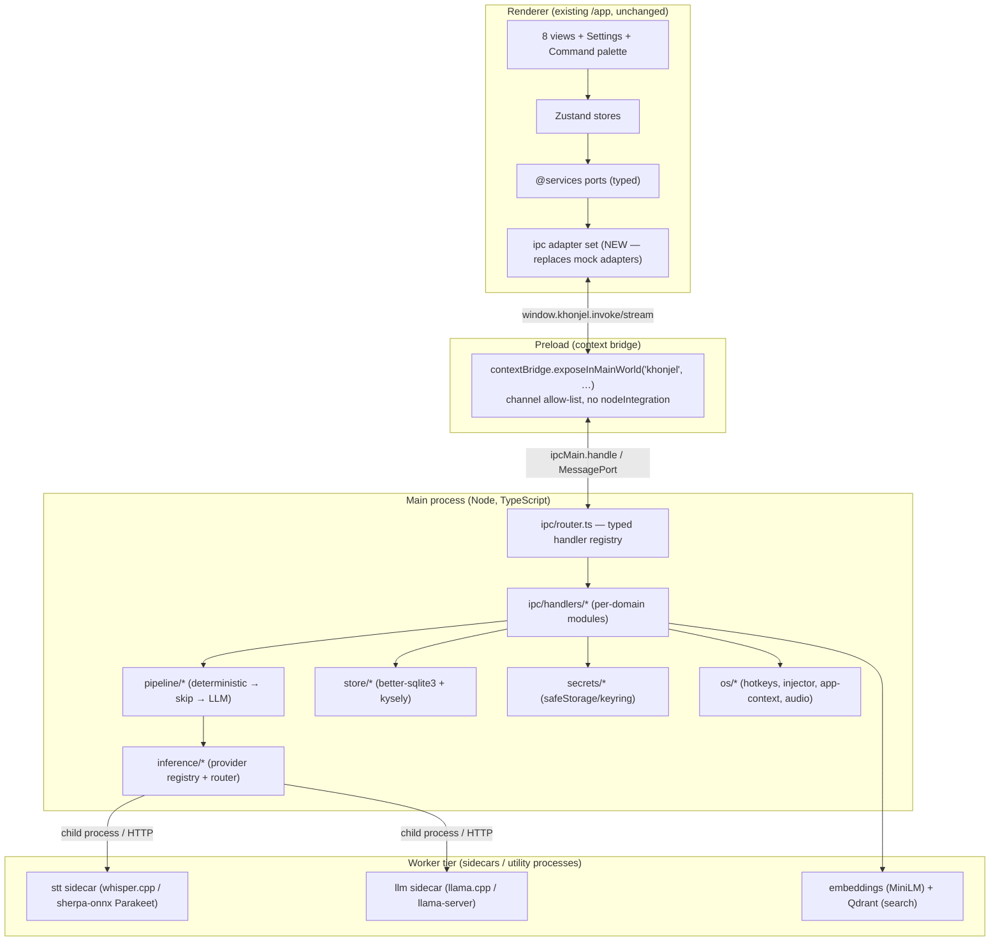
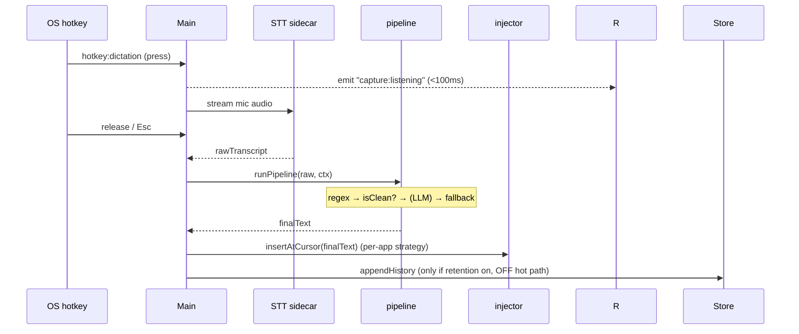

# 03 — Khonjel backend architecture (recommended)

> The implementation-grade backend design. Higher-level context lives in
> [`../01-system-architecture.md`](../01-system-architecture.md); this doc is the
> **code-level** plan: processes, the typed IPC seam that mirrors `@services`, main-process
> module layout, the text pipeline as concrete modules, and runtime flows per capture mode.
> Embodies the decision in [02](02-benchmarks-comparison.md): *OpenWhispr structure + FreeFlow pipeline.*

---

## 1. Process model (three tiers)



**Why three tiers.** The renderer must never freeze while a model runs. Heavy/slow work
(STT decode, LLM generate, embeddings) lives in **sidecar/utility processes**, so a stalled
model can't block capture UI (principle: *hot path is sacred*). The main process stays thin:
routing, orchestration, persistence, OS calls.

> **Improvement over OpenWhispr:** orchestration moves *out of the renderer* into main; the
> renderer only calls typed ports. **Improvement over both:** TypeScript end-to-end.

## 2. The seam — one typed IPC contract mirroring `@services`

The frontend already imports only `@services` ports (today backed by mock adapters). The
backend introduces **`ipc` adapters** that implement the *same* interfaces by calling main.
**No view *redesign*.** (One honest caveat: synchronous mock reads become `Promise`-returning
under `ipc`, so those call sites adopt `await`/Suspense — a mechanical change, not a redesign.)
Full channel list in [08](08-ipc-and-ports-contracts.md); the principle:

```ts
// shared/ipc-contract.ts  (imported by BOTH preload and the renderer ipc-adapter)
export interface IpcContract {
  // request/response (ipcMain.handle)
  "profile:get": () => Profile;
  "system:getAppVersion": () => string;
  "transcription:start": (opts: StartCaptureOpts) => CaptureSession;
  "transcription:cancel": (sessionId: string) => void;
  "inference:complete": (req: CompleteRequest) => CompleteResult;
  "models:list": (kind: "stt" | "llm") => ModelInfo[];
  "models:download": (modelId: string) => DownloadHandle;
  "settings:get": () => SettingsSnapshot;                  // { toggles, values } flat maps
  "settings:patch": (patch: SettingsPatch) => SettingsSnapshot; // partial flat maps
  "content:notes": () => Note[];
  // …one entry per port method
}
// streaming (MessagePort / ipcMain.on emit): "transcription:partial",
// "inference:token", "models:progress", "hotkey:fired", "meeting:detected"
```

- **`shared/`** is the single source of truth for channel names + payload types, imported by
  preload, the renderer adapter, and main. A channel that isn't in the allow-list is rejected.
- **Generated adapter:** the renderer `ipc` adapter is a thin typed wrapper
  (`invoke<K>(channel, …args)` / `subscribe<K>(channel, cb)`), so adding a port method is a
  one-line change in three known places, all type-checked.

```ts
// app/src/services/adapters/ipc/index.ts  (replaces adapters/mock at runtime)
export function createIpcServices(): Services {
  return {
    profile: { get: () => invoke("profile:get") },
    system:  { getAppVersion: () => invoke("system:getAppVersion"),
               getPlatform:   () => invoke("system:getPlatform") },
    content: { notes: () => invoke("content:notes"), /* … */ },
    // new action ports (transcription, inference, models, settings, …) added per phase
  };
}
```

> `useServices()` ([app/src/services/index.ts](../../../../app/src/services/index.ts)) picks
> `mock` in the browser/dev and `ipc` under Electron — the only switch point.

## 3. Main-process module layout (split the monolith)

OpenWhispr's `ipcHandlers.js` is one giant file. Khonjel splits by domain:

```
app/electron/                      (built to main.cjs by electron-builder)
  main.ts                          app/window lifecycle, single-instance, tray
  preload.ts                       contextBridge allow-list (channels from shared/)
  ipc/
    router.ts                      register(contract) → ipcMain.handle, typed
    handlers/
      profile.ts  system.ts  settings.ts
      transcription.ts             start/cancel capture, emit partials
      inference.ts                 cleanup/agent/format/chat completions
      models.ts                    catalog, download, cache, hardware probe
      content.ts                   history/notes/folders/dictionary/snippets/transforms
      meeting.ts  integrations.ts  hotkeys.ts
  pipeline/
    index.ts                       run(rawTranscript, ctx) → finalText
    substitute.ts                  STAGE 1 dictated-punctuation regex (+<keep>)
    isClean.ts                     STAGE 2 skip heuristic
    refine.ts                      STAGE 3 LLM cleanup (calls inference)
    detectAgent.ts                 instruction-mode split (agentName)
    dictionary.ts  snippets.ts  style.ts
  inference/
    router.ts                      mode router (local/self-hosted/providers/enterprise/cloud)
    providers/                     openai.ts anthropic.ts gemini.ts groq.ts local.ts lan.ts …
    prompts/                       resolvePrompt + kinds + i18n (see 05)
    proxyFetch.ts                  all provider HTTP from main (keys never in renderer)
  stt/                             sidecar manager (whisper.cpp / sherpa-onnx)
  store/                           better-sqlite3 + kysely; migrations (see 09)
  secrets/                         safeStorage / @napi-rs/keyring (see 11)
  os/                              hotkeys.ts injector.ts app-context.ts audio.ts
  shared/                          ipc-contract.ts + domain types (imported by renderer too)
```

Each `handlers/*` file registers only its own channels; `router.ts` composes them. Adding a
feature = add a handler module + a contract entry + a renderer adapter method.

## 4. The text pipeline (ported from FreeFlow, multi-purpose)

`pipeline/index.ts` is the single entry the capture flow calls. Stages, in order:

```ts
export async function runPipeline(raw: string, ctx: PipelineContext): Promise<PipelineResult> {
  const dict = applyDictionary(raw, ctx.dictionary);          // recognition + substitutions
  const punct = applyDictatedPunctuation(dict);               // STAGE 1: regex, <keep> guard
  if (detectAgent(punct, ctx.agentName)) {                    // instruction mode → Voice Agent
    return runAgent(stripAgentName(punct), ctx);
  }
  if (!ctx.cleanupEnabled || isClean(punct)) {                // STAGE 2: skip LLM if already clean
    return { text: expandSnippets(punct, ctx.snippets), cleaned: false };
  }
  const refined = await refineWithLLM(punct, ctx).catch(() => punct); // STAGE 3 + fallback
  const styled = ctx.styleEnabled ? applyStyle(refined, ctx.appContext) : refined;
  return { text: expandSnippets(styled, ctx.snippets), cleaned: true };
}
```

- **Never blocks the user:** STAGE 3 failure falls back to STAGE 1 output.
- **`isClean` skip** is the big latency/cost win (FreeFlow reports the large majority of
  dictations skip the LLM; we must measure the rate for our own models). Heuristic detail in
  [05 §skip-heuristic](05-prompt-library.md).
- **Multi-purpose reuse:** the *same* pipeline serves dictation, note-recording cleanup, and
  upload transcription cleanup; only `ctx` (prompt kind, style, agentName) differs.

## 5. Inference router (five modes, one interface)

`inference/router.ts` exposes the conceptual interface from
[`../01-system-architecture.md §4`](../01-system-architecture.md) — `transcribe`,
`complete` (stream|text), `listModels` — and dispatches to a mode adapter, which dispatches to
a **provider** (strategy pattern from OpenWhispr). All provider HTTP goes through
`proxyFetch.ts` in main. Six independent config **slots** select model+mode each:
`STT.dictation`, `STT.note`, `LLM.cleanup`, `LLM.agent`, `LLM.note`, `LLM.chat`. Detail in
[10](10-providers-and-models.md).

## 6. Runtime flows (per capture mode)

### 6.1 Dictation (the hot path)


### 6.2 Voice agent (instruction mode)
`detectAgent(text, agentName)` true → `runAgent()` → tool-calling completion (Vercel `ai`
SDK, bounded steps) with tools `search_notes / create_note / get_calendar_events /
copy_to_clipboard / web_search`. Streams tokens to the Agent overlay.

### 6.3 Note-recording, 6.4 Upload, 6.5 Meeting, 6.6 Chat, 6.7 Transforms
Same router + pipeline, different `ctx`/prompt kind and sink (note store, upload job result,
meeting doc, chat stream, clipboard/cursor). Mapped exhaustively in
[07 coverage matrix](07-feature-coverage-matrix.md).

## 7. Threading & cancellation
- Every long op takes an **`AbortSignal`**; `transcription:cancel` / `inference:cancel`
  propagate to the sidecar. (`Esc` aborts capture cleanly.)
- One **`AbortController` per stream**; partials emitted over a `MessagePort` to avoid
  flooding the default IPC channel.
- Backpressure: if a model is downloading, capture **queues with a visible note**, never blocks.

## 8. Build & boot
- **New build step (net-new):** today `electron/main.cjs`/`preload.cjs` are *hand-authored
  CommonJS* — there is no TypeScript compile for the main process yet. Adding one
  (esbuild/tsup: `electron/**/*.ts` → `.cjs`) is new work; electron-builder then packages the
  output. This sits alongside, and does not change, the renderer's Vite build.
- Boot order: load settings (main) → init store/migrations → register hotkeys → warm the
  default STT sidecar (lazy LLM) → create windows → renderer mounts with `ipc` services.
- Single-instance lock; second launch focuses the existing window.

## 9. Acceptance checklist
- [ ] Renderer imports only `@services`; swapping mock→ipc needs no view *redesign* (only sync→async call-site adaptation).
- [ ] `shared/ipc-contract.ts` is the only place channel names/types live; preload allow-lists them.
- [ ] Main process is TypeScript, split into per-domain handler modules (no monolith).
- [ ] Pipeline runs deterministic→skip→LLM→fallback; LLM never on the critical path for clean text.
- [ ] STT/LLM run in sidecars; a stalled model cannot freeze capture.
- [ ] Settings source-of-truth is main (SQLite), mirrored to the renderer store.
- [ ] All provider HTTP flows through `proxyFetch` in main; keys never reach the renderer.
