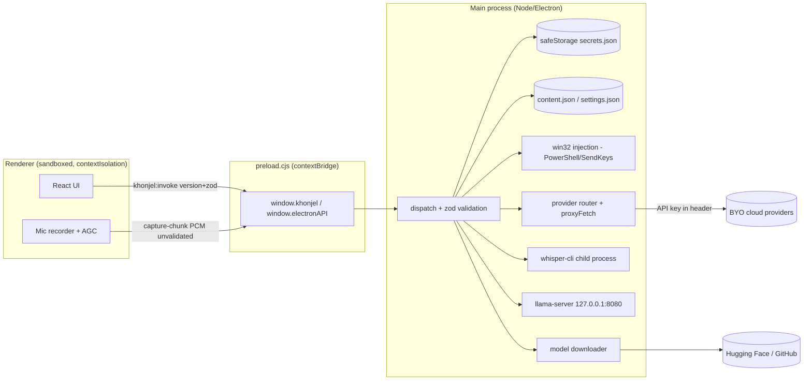

# Khonjel — Security & Privacy Audit

**Date:** 2026-06-23
**Scope:** `app/` (Electron main process, preload bridge, React renderer, build & fetch scripts, dependency manifest)
**Reviewer:** Automated source audit (GitHub Copilot)
**Commit baseline:** `main` @ `a714e63`
**App type:** Local-first, privacy-first Windows desktop voice-productivity app (Electron 42 + React 19), with on-device whisper.cpp (STT) and llama.cpp (LLM) behind a typed IPC seam, and optional bring-your-own-key cloud providers.

> **Methodology.** Static review of the full main-process composition root, the preload `contextBridge` surface, the IPC dispatch/validation layer, secret storage, the provider network edge, OS injection (clipboard/keystroke/audio), model download/verification, and build/release configuration. Benchmarked against the **Electron Security Checklist** (official 17 controls), **OWASP Top 10 (2021)**, **OWASP ASVS**-style controls, common **desktop privacy** expectations, and software-supply-chain practice (signing, hash pinning, SLSA-style integrity).

---

## 1. Executive summary

Khonjel has a **strong security foundation** and an **excellent privacy-by-architecture posture**. The Electron process model is configured the way the official guidance recommends — `contextIsolation: true`, `nodeIntegration: false`, and `sandbox: true` on **every** window — and the renderer reaches the OS only through a single, version-checked, **zod-validated** IPC channel. The app does on-device inference by default, ships **no telemetry, analytics, crash reporting, or auto-update beacon**, stores API keys in the **OS keychain** (`safeStorage`), and grants only the **microphone** permission while denying everything else.

The material gaps are concentrated in three areas, none of which appear to be actively exploited but all of which fall short of "best in class":

1. **Renderer hardening** — there is **no Content-Security-Policy** and **no navigation lock** (`will-navigate`). React mitigates routine XSS, but these two controls are the defense-in-depth backstop that keeps a single injection from reaching the powerful preload bridge.
2. **Supply-chain integrity** — local model downloads are **not hash-pinned**, and the shipped Windows binary is **unsigned with no auto-update**, so users won't receive Chromium/Electron security patches.
3. **Data-at-rest** — transcripts, notes, and chats are stored as **plaintext JSON**, and on systems without OS encryption the secret store **silently downgrades to base64** (effectively plaintext).

### Overall ratings

| Domain | Rating | Notes |
|---|---|---|
| Electron process hardening | **A−** | Excellent baseline; missing CSP + navigation lock |
| IPC / privilege boundary | **A** | Allow-list + contract version + zod validation; add sender checks |
| Secrets management | **B+** | OS keychain; insecure silent fallback on keyring-less hosts |
| Network / provider edge | **B** | Main-process only; no TLS enforcement or timeouts |
| Data-at-rest privacy | **B** | No audio retention (great); content/keys plaintext on disk |
| Supply-chain integrity | **C+** | No model hash pinning; unsigned build; no update channel |
| Telemetry / data exfiltration | **A** | None found — strong |
| **Overall** | **B+** | Solid, privacy-respecting; close a few high-value gaps |

---

## 2. Architecture & trust boundaries



**Trust boundaries crossed:**
- Renderer to Main — mediated by the preload bridge; the only typed path is `khonjel:invoke` (validated). High-rate audio uses an unvalidated one-way channel.
- Main to OS — child processes (`whisper-cli`, `llama-server`, PowerShell), clipboard, global shortcuts, login item.
- Main to Network — provider HTTP (user-configured endpoints + API key) and model/binary downloads.

---

## 3. Findings

Severity uses a qualitative CVSS-aligned scale. IDs are stable for tracking.

### Summary table

| ID | Severity | Title | Area |
|---|---|---|---|
| H1 | **High** | No Content-Security-Policy on renderer | Electron / XSS |
| H2 | **High** | No navigation lock (`will-navigate`/`will-redirect`) | Electron |
| H3 | **High** | Local model downloads are not hash-pinned | Supply chain |
| M1 | Medium | Secret store silently downgrades to plaintext base64 | Crypto |
| M2 | Medium | User content (transcripts/notes/chat) stored as plaintext | Privacy |
| M3 | Medium | Provider endpoint scheme not validated (allows `http://`) | Network |
| M4 | Medium | No timeouts / response-size limits on provider fetch | Network / DoS |
| M5 | Medium | Unsigned binary + no auto-update / patch channel | Supply chain |
| L1 | Low | `capture-chunk` IPC accepts unvalidated input | IPC |
| L2 | Low | Unused native dependency (`better-sqlite3`) shipped | Supply chain |
| L3 | Low | Local llama-server has no auth (localhost-only) | Local services |
| L4 | Low | Keystroke ("type") injection can reach shells | Injection |
| L5 | Low | Clipboard not restored after paste injection | Privacy |
| L6 | Low | Dev fetch scripts download+exec binaries without checksums | Supply chain |
| L7 | Low | IPC handlers do not validate sender frame/origin | IPC |
| I1 | Info | Auto-launch at login defaults to enabled | Privacy/consent |
| I2 | Info | DevTools openable in production | Hardening |
| I3 | Info | No dependency-audit / SBOM in workflow | Process |

---

### H1 — No Content-Security-Policy on the renderer  *(High)*

**Location:** [app/index.html](app/index.html), [app/electron/main/main.ts](app/electron/main/main.ts) (no `onHeadersReceived` CSP)

**Observation.** The renderer HTML ships no `<meta http-equiv="Content-Security-Policy">`, and the main process does not inject a CSP via `session.defaultSession.webRequest.onHeadersReceived`. The Electron Security Checklist (#7) treats a CSP as a primary control.

**Impact.** The renderer displays untrusted text from multiple sources — live transcripts, notes, chat history, and **LLM/cloud-provider output**. React escapes string interpolation, but any future `dangerouslySetInnerHTML`, a vulnerable transitive dependency, or a markdown/HTML renderer would turn that untrusted text into script execution. Because the renderer holds the `window.khonjel` bridge, script execution there can drive OS-side IPC (inject keystrokes, read connections, exfiltrate via a bound provider). A CSP is the backstop that blocks inline/remote script even if an injection occurs.

**Recommendation.** Add a strict CSP. Because Vite output is hashed and local, a tight policy is feasible:

```
default-src 'self';
script-src 'self';
style-src 'self' 'unsafe-inline';      /* Tailwind injects styles; tighten with nonces if possible */
img-src 'self' data:;
font-src 'self' data:;
connect-src 'self' http://127.0.0.1:8080;  /* local llama-server; add bound provider origins as needed */
object-src 'none';
base-uri 'none';
frame-ancestors 'none';
form-action 'none';
```
Prefer setting it from `onHeadersReceived` (covers both the file load and the dev server) and assert it in an eval.

---

### H2 — No navigation lock  *(High)*

**Location:** [app/electron/main/main.ts](app/electron/main/main.ts) — only `setWindowOpenHandler` is present (line ~328); no `will-navigate`/`will-redirect` handlers.

**Observation.** New-window creation is correctly denied and external links are routed to the OS browser. However, **top-level navigation of the existing window is not constrained**. Nothing prevents the renderer (or injected content/redirect) from navigating `mainWindow` to a remote origin.

**Impact.** If the renderer is ever navigated to attacker-controlled web content, that content runs **with the preload bridge attached** (`window.khonjel`, `window.electronAPI`), collapsing the renderer/main trust boundary. This is the Electron Checklist #13 control and pairs with H1 as the standard XSS-containment duo.

**Recommendation.**
```ts
const ALLOWED = new Set(["file://", "http://localhost:5173"]); // dev server only when --dev-server
app.on("web-contents-created", (_e, contents) => {
  contents.on("will-navigate", (e, url) => {
    if (![...ALLOWED].some((p) => url.startsWith(p))) e.preventDefault();
  });
  contents.on("will-redirect", (e, url) => {
    if (![...ALLOWED].some((p) => url.startsWith(p))) e.preventDefault();
  });
});
```

---

### H3 — Local model downloads are not cryptographically pinned  *(High)*

**Location:** [app/electron/main/models/catalog.ts](app/electron/main/models/catalog.ts) (manifests omit `sha256`/`bytes`), [app/electron/main/models/downloader.ts](app/electron/main/models/downloader.ts) (verification is conditional).

**Observation.** The downloader **supports** size + SHA-256 verification, atomic rename, and resume — a good design. But the catalog `MANIFESTS` define only `sources[]` (HTTPS Hugging Face URLs) with **no `sha256` and no `bytes`**. With both absent, the only integrity check is "the transfer completed" (non-empty file). The download source can also be overridden at runtime via `KHONJEL_MODEL_SOURCES`.

**Impact.** The downloaded artifacts are **native model files** (`.gguf`, `.bin`) parsed by `llama.cpp`/`whisper.cpp` — historically a memory-safety-sensitive surface (malformed GGUF has produced CVEs in loaders). A compromised mirror, a Hugging Face account/repo takeover, a CDN/MITM weakness, or a poisoned `KHONJEL_MODEL_SOURCES` could deliver a malicious model that executes in native code. This is OWASP A08 (Software & Data Integrity Failures).

**Recommendation.** Pin `sha256` (and ideally `bytes`) for every shipped model in `MANIFESTS`; the downloader already enforces them when present. Treat `KHONJEL_MODEL_SOURCES` as advisory but **still verify the pinned hash** regardless of source. Re-pin on every catalog update via a build step.

---

### M1 — Secret store silently downgrades to plaintext  *(Medium)*

**Location:** [app/electron/main/secrets/safeStorageCipher.ts](app/electron/main/secrets/safeStorageCipher.ts)

**Observation.** When `safeStorage.isEncryptionAvailable()` is false (e.g., a Linux session with no Secret Service/keyring), the cipher falls back to `raw:<base64>` — i.e., the API key is persisted **unencrypted** (base64 is encoding, not encryption). The downgrade is silent.

**Impact.** On affected hosts, provider API keys in `secrets.json` are readable by any process running as the user or anyone with file access. Users believe keys are protected by the OS keychain.

**Recommendation.** Do not silently store plaintext. Options: (a) refuse to persist and keep the key in-memory for the session, surfacing a clear warning; (b) prompt for a passphrase and derive a key (Argon2id/scrypt) to encrypt at rest; (c) at minimum, label such connections as "key stored unencrypted on this device" in the UI. On Windows (the shipped target) DPAPI is normally available, so this primarily affects Linux/headless.

---

### M2 — User content stored as plaintext on disk  *(Medium)*

**Location:** [app/electron/main/services/content.ts](app/electron/main/services/content.ts) (`content.json`), settings/connections JSON in `userData`.

**Observation.** History (full transcripts in `finalText`), notes, chat, dictionary, and snippets persist as a single plaintext JSON document. (Positive: **audio is not retained** — temp WAVs are deleted after transcription and `hasAudio` is `false`; the `saveHistory` toggle lets users disable history entirely.)

**Impact.** Dictated content can be highly sensitive (messages, medical/legal notes, credentials spoken aloud). Plaintext at rest means any local process or backup captures it in the clear. Best-in-class privacy tools offer optional at-rest encryption.

**Recommendation.** Offer optional encryption-at-rest for `content.json` (e.g., `safeStorage`-wrapped document key, or passphrase-derived key). Ensure `userData` files are created with user-only permissions. Document the storage model and retention controls in a privacy note. Consider a retention policy / "auto-purge history after N days."

---

### M3 — Provider endpoint scheme not validated  *(Medium)*

**Location:** [app/electron/main/providers/request.ts](app/electron/main/providers/request.ts), [app/electron/main/providers/proxyFetch.ts](app/electron/main/providers/proxyFetch.ts), [app/electron/main/providers/test.ts](app/electron/main/providers/test.ts)

**Observation.** `baseEndpoint` is user-supplied and used verbatim. There is no enforcement that remote endpoints use TLS. A connection saved with `http://…` would transmit the **API key (in headers)** and **audio/text payloads** in cleartext.

**Impact.** Credential and content disclosure on hostile networks; also a mild SSRF vector (the main process will POST to arbitrary user-entered hosts). For a BYO-key desktop app the SSRF risk is largely self-inflicted, but the cleartext-key risk is real.

**Recommendation.** Require `https://` for non-loopback endpoints; allow `http://` only for `localhost`/`127.0.0.1`. Reject or warn on save and at request time. Consider an allowlist of known provider hosts per `kind`.

---

### M4 — No timeouts or response-size limits on provider fetch  *(Medium)*

**Location:** [app/electron/main/providers/proxyFetch.ts](app/electron/main/providers/proxyFetch.ts)

**Observation.** `fetch` calls have no `AbortController` timeout, and responses are fully buffered (`res.text()` then `JSON.parse`) with no size cap.

**Impact.** A slow or hostile endpoint can hang chat/transcription indefinitely; a very large response can pressure memory. Low-severity availability issue.

**Recommendation.** Add a configurable timeout via `AbortSignal.timeout(...)`, cap response size, and surface a clean error.

---

### M5 — Unsigned binary and no update channel  *(Medium)*

**Location:** [app/package.json](app/package.json) `build` block (Windows `portable`; no `certificateFile`/signing, no `publish`/`electron-updater`).

**Observation.** The release is an unsigned portable `.exe`. There is no auto-update or update-check mechanism.

**Impact.** (1) Users get SmartScreen warnings and have no cryptographic assurance the binary is authentic/untampered (A08). (2) **No update path means shipped Electron/Chromium CVEs are never patched on user machines** — over time this becomes the single largest risk for any Electron app.

**Recommendation.** Code-sign releases (Authenticode; EV cert for best SmartScreen reputation). Add a signed update channel (`electron-updater` with signature verification, or at minimum a signed-release + in-app "update available" check). Track Electron security releases and ship promptly.

---

### Low / Informational

- **L1 — `capture-chunk` unvalidated IPC.** [app/electron/main/main.ts](app/electron/main/main.ts) registers `ipcMain.on("khonjel:capture-chunk", …)` and forwards `sessionId`/base64 to the segmenter with no type/size checks (preload: [app/electron/main/preload.ts](app/electron/main/preload.ts)). Renderer-trusted and low-risk, but add basic guards (string types, max chunk size, known-session check) to avoid memory pressure from a buggy/compromised renderer.
- **L2 — Unused native dependency.** [app/electron/store/db.ts](app/electron/store/db.ts) wires `better-sqlite3`, but the live composition persists via JSON files; the DB appears unused. Shipping an unused native module enlarges the attack/supply-chain surface and complicates rebuilds. Remove if unused, or wire it intentionally.
- **L3 — Local llama-server has no auth.** [app/electron/main/inference/llama-server.ts](app/electron/main/inference/llama-server.ts) binds `127.0.0.1:8080` with no token. Any local process can call it. Acceptable on a single-user desktop; harden by binding an ephemeral port and/or a per-session token, and documenting the exposure.
- **L4 — Keystroke injection can reach shells.** [app/electron/main/injection/win32.ts](app/electron/main/injection/win32.ts) `typeText` synthesizes keystrokes (newlines become `{ENTER}`). Input is escaped for SendKeys ([app/electron/main/injection/sendkeys.ts](app/electron/main/injection/sendkeys.ts)) and PowerShell single-quoting, so there is **no command-injection into PowerShell**. However, by design the cleaned dictation/transform text is typed into the focused window — if that window is a terminal, dictated text (including an Enter) is executed. Consider not auto-sending Enter, or warning when the foreground app is a shell.
- **L5 — Clipboard not restored.** The `paste` and `type` strategies in [app/electron/main/injection/injector.ts](app/electron/main/injection/injector.ts) leave the cleaned text on the clipboard (paste path) and do not restore prior contents. Minor data-remanence/UX privacy issue; consider save/restore around injection.
- **L6 — Dev fetch scripts.** [app/scripts/fetch-whisper.mjs](app/scripts/fetch-whisper.mjs) (and the llama equivalent) download executables/models over HTTPS with **no checksum** and then execute the binary. Developer-time supply chain; pin checksums for vendored binaries and verify before first run.
- **L7 — No IPC sender validation.** Handlers in [app/electron/main/main.ts](app/electron/main/main.ts) don't check `event.senderFrame` origin (Electron Checklist #17). Low risk given `contextIsolation` + only app-origin frames, but adding an origin assertion is cheap defense-in-depth.
- **I1 — Auto-launch defaults on.** `app.setLoginItemSettings({ openAtLogin: launchAtLogin ?? true })` defaults to enabled. Prefer opt-in (first-run consent) for a background-capable, mic-using app.
- **I2 — DevTools in production.** `system:open-devtools` can open DevTools in packaged builds; DevTools can inspect in-memory transcripts/keys. Acceptable for a power tool; consider gating behind a debug flag.
- **I3 — No dependency audit / SBOM.** No `npm audit`/Dependabot/SBOM step is evident. Add automated dependency scanning and an SBOM to the release pipeline.

---

## 4. Strengths (verified, keep these)

- **Process isolation done right** — `contextIsolation: true`, `nodeIntegration: false`, `sandbox: true` on **both** the main and floating-bar windows ([app/electron/main/main.ts](app/electron/main/main.ts)). Meets Electron Checklist #2–4.
- **Minimal, validated IPC surface** — one generic `khonjel:invoke` channel, a **contract-version check** on every call, then per-channel **zod validation** before any handler runs ([app/electron/shared/dispatch.ts](app/electron/shared/dispatch.ts), [app/electron/shared/ipc-schemas.ts](app/electron/shared/ipc-schemas.ts), [app/electron/main/preload.ts](app/electron/main/preload.ts)). Unknown channel to `not_found`, bad payload to `validation`.
- **Secrets isolated from the renderer** — keys live in `safeStorage` (DPAPI/Keychain/libsecret) and the IPC surface exposes only `set`/`has`/`remove`; decryption (`get`) is **main-only**, used at request time ([app/electron/main/secrets/store.ts](app/electron/main/secrets/store.ts)). Removing a connection also drops its key.
- **Least-privilege permissions** — only `media` (microphone) is granted; the request **and** check handlers deny everything else ([app/electron/main/main.ts](app/electron/main/main.ts)).
- **No data exfiltration** — no telemetry, analytics, crash reporting, or auto-update beacon found anywhere in `src/` or `electron/`. Cloud calls happen **only** when the user explicitly binds a connection.
- **Local-first inference** — STT (`whisper-cli`) and LLM (`llama-server`) run on-device; the deterministic stub keeps the app working with no model.
- **No-shell child processes** — `whisper-cli` (`execFile`), `llama-server` (`spawn`), and PowerShell calls all use **array argv** (no shell string), so there is no OS command-injection path ([app/electron/main/stt/runtime.ts](app/electron/main/stt/runtime.ts), [app/electron/main/inference/llama-server.ts](app/electron/main/inference/llama-server.ts), [app/electron/main/injection/win32.ts](app/electron/main/injection/win32.ts)).
- **Audio is not retained** — per-window temp WAVs are deleted after transcription; history records `hasAudio: false`.
- **Safe external-link handling** — `setWindowOpenHandler` denies in-app windows and routes `http(s)` to the OS browser.
- **No web storage of sensitive data** — no `localStorage`/`sessionStorage`/`indexedDB`/cookies used in the renderer; settings sync to main-process JSON, not the DOM.
- **Current Electron** — v42.x (Checklist #16).
- **Local network binding** — llama-server binds `127.0.0.1`, not `0.0.0.0`.

---

## 5. Benchmarking against industry standards

### 5.1 Electron Security Checklist (official 17)

| # | Control | Status | Reference |
|---|---|---|---|
| 1 | Load only secure content | ✅ Prod loads local files; dev server is HTTP and dev-only | main.ts |
| 2 | No `nodeIntegration` for remote content | ✅ `false` everywhere | main.ts |
| 3 | Enable `contextIsolation` | ✅ | main.ts |
| 4 | Enable sandbox | ✅ `sandbox: true` | main.ts |
| 5 | Handle session permission requests | ✅ media-only | main.ts |
| 6 | Do not disable `webSecurity` | ✅ not disabled | — |
| 7 | Define a CSP | ❌ **missing (H1)** | index.html |
| 8 | No `allowRunningInsecureContent` | ✅ | — |
| 9 | No experimental features | ✅ | — |
| 10 | No `enableBlinkFeatures` | ✅ | — |
| 11 | `<webview>`: no `allowpopups` | ✅ N/A (no webview) | — |
| 12 | Verify `<webview>` options | ✅ N/A | — |
| 13 | Disable/limit navigation | ❌ **missing (H2)** | main.ts |
| 14 | Limit new-window creation | ✅ deny handler | main.ts |
| 15 | No `shell.openExternal` with untrusted input | ⚠️ http(s) only, no host allowlist | main.ts |
| 16 | Current Electron | ✅ v42 | package.json |
| 17 | Validate IPC sender | ⚠️ **not validated (L7)** | main.ts |

**Score: 13 pass / 2 fail / 2 partial.**

### 5.2 OWASP Top 10 (2021)

| Category | Assessment |
|---|---|
| A01 Broken Access Control | **Good** — IPC allow-list; secrets main-only. |
| A02 Cryptographic Failures | **Gaps** — plaintext fallback (M1), plaintext content (M2), `http://` allowed (M3). |
| A03 Injection | **Good** — no-shell execFile/spawn; zod validation; SendKeys/PS escaping. Residual keystroke-to-shell (L4). |
| A04 Insecure Design | **Good** — local-first, least privilege. Missing CSP/nav-lock weakens the design backstop. |
| A05 Security Misconfiguration | **Gaps** — CSP (H1), navigation (H2), unsigned build (M5). |
| A06 Vulnerable/Outdated Components | **Mostly good** — Electron current; unused native dep (L2); no audit/SBOM (I3). |
| A07 Identification/Auth Failures | **Minor** — local llama-server unauthenticated (L3). |
| A08 Software & Data Integrity | **Primary theme** — model downloads unpinned (H3); unsigned + no update (M5); dev scripts (L6). |
| A09 Logging & Monitoring | **By design minimal** — privacy-positive; no security logging (acceptable for local app). |
| A10 SSRF | **Low/by-design** — user-configured endpoints; add scheme/host validation (M3). |

### 5.3 Privacy posture vs. expectations for a local-first dictation app

| Principle | Status |
|---|---|
| Data minimization | ✅ No audio retention; history toggle; no analytics. |
| On-device processing by default | ✅ Local whisper + llama; cloud is explicit opt-in. |
| Transparency | ⚠️ No in-repo privacy note describing what is stored where (recommend adding). |
| User control / deletion | ✅ "Reset all data" wipes settings/content/connections/secrets; "Delete models". |
| Confidentiality at rest | ⚠️ Content + (fallback) keys plaintext (M1/M2). |
| Confidentiality in transit | ⚠️ TLS not enforced for provider endpoints (M3). |

### 5.4 Supply-chain / integrity

| Practice | Status |
|---|---|
| Artifact hash pinning (models) | ❌ Not pinned (H3) — mechanism exists, values absent. |
| Code signing | ❌ Unsigned (M5). |
| Secure auto-update | ❌ None (M5). |
| Reproducible/verified vendored binaries | ❌ Dev scripts unverified (L6). |
| Dependency scanning / SBOM | ❌ Not evident (I3). |
| Pinned dependency ranges | ⚠️ Caret ranges; rely on lockfile (ensure `package-lock.json` is committed & CI-installed with `npm ci`). |

---

## 6. Prioritized remediation roadmap

**Now (high value, low effort):**
1. **H1** — Add a strict CSP via `onHeadersReceived` + an eval that asserts it.
2. **H2** — Add `will-navigate`/`will-redirect` deny-by-default.
3. **M3** — Enforce `https://` for non-loopback provider endpoints (validate on save + at request time).
4. **L1** — Add type/size/known-session guards to `capture-chunk`.

**Next (closes the integrity theme):**
5. **H3** — Pin `sha256` for all catalog models; verify regardless of source override.
6. **M5** — Code-sign releases and add a signed update channel; commit to tracking Electron security releases.
7. **M1** — Stop silently persisting plaintext keys; warn or require a passphrase when `safeStorage` is unavailable.

**Then (depth & polish):**
8. **M2** — Optional at-rest encryption for `content.json`; user-only file permissions; retention controls; publish a privacy note.
9. **M4** — Provider fetch timeouts + response-size caps.
10. **L2–L7, I1–I3** — Remove unused native dep, token the local server, restore clipboard, validate IPC sender, default auto-launch to opt-in, gate DevTools, add `npm audit`/SBOM to CI.

---

## 7. Appendix — files reviewed

- Main / windows / permissions / IPC wiring: [app/electron/main/main.ts](app/electron/main/main.ts)
- Preload bridge: [app/electron/main/preload.ts](app/electron/main/preload.ts)
- IPC validation: [app/electron/shared/dispatch.ts](app/electron/shared/dispatch.ts), [app/electron/shared/ipc-schemas.ts](app/electron/shared/ipc-schemas.ts)
- Secrets: [app/electron/main/secrets/store.ts](app/electron/main/secrets/store.ts), [app/electron/main/secrets/safeStorageCipher.ts](app/electron/main/secrets/safeStorageCipher.ts)
- Network edge: [app/electron/main/providers/proxyFetch.ts](app/electron/main/providers/proxyFetch.ts), [app/electron/main/providers/request.ts](app/electron/main/providers/request.ts), [app/electron/main/providers/router.ts](app/electron/main/providers/router.ts), [app/electron/main/providers/test.ts](app/electron/main/providers/test.ts)
- Content/persistence: [app/electron/main/services/content.ts](app/electron/main/services/content.ts), [app/electron/store/db.ts](app/electron/store/db.ts)
- OS injection: [app/electron/main/injection/win32.ts](app/electron/main/injection/win32.ts), [app/electron/main/injection/sendkeys.ts](app/electron/main/injection/sendkeys.ts), [app/electron/main/injection/injector.ts](app/electron/main/injection/injector.ts)
- Local engines: [app/electron/main/inference/llama-server.ts](app/electron/main/inference/llama-server.ts), [app/electron/main/stt/whisper.ts](app/electron/main/stt/whisper.ts), [app/electron/main/stt/runtime.ts](app/electron/main/stt/runtime.ts)
- Model supply chain: [app/electron/main/models/catalog.ts](app/electron/main/models/catalog.ts), [app/electron/main/models/downloader.ts](app/electron/main/models/downloader.ts), [app/scripts/fetch-whisper.mjs](app/scripts/fetch-whisper.mjs)
- Build/release & deps: [app/package.json](app/package.json), [app/index.html](app/index.html), [app/vite.config.ts](app/vite.config.ts)

> This audit is a static source review and does not replace dynamic testing (DAST), a dependency-vulnerability scan, or a penetration test. Treat the roadmap as the basis for those follow-ups.
