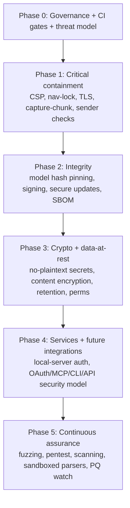

# Khonjel — Security & Privacy Hardening Program

**Status:** Proposed plan
**Date:** 2026-06-23
**Companion document:** [docs/security-privacy-audit.md](docs/security-privacy-audit.md)
**Owner:** _TBD (assign a Security Champion)_

> This is the remediation **and** future-proofing plan derived from the security & privacy audit. It is intentionally exhaustive: it closes every finding (H1–H3, M1–M5, L1–L7, I1–I3) **and** establishes security as a continuous program so the app stays hardened as it grows (cloud providers, the planned Google Calendar / MCP / CLI-bridge / Public-API integrations, macOS/Linux targets, and future Electron/Chromium CVEs).
>
> The repo is **eval-driven**: every control below ships with a verifying eval or unit test so the protection cannot silently regress. "Done" = code + test/eval green + documented.

---

## 0. Principles & how to read this plan

### 0.1 Security & privacy principles (the rules we design to)

1. **Local-first, zero-exfiltration by default.** Nothing leaves the device unless the user explicitly binds a cloud connection. No telemetry, ever.
2. **Least privilege.** Every window, process, IPC channel, integration, and OS capability gets the minimum it needs.
3. **Defense in depth.** Assume any single control fails; layer CSP + navigation lock + sandbox + IPC validation so one bug is contained.
4. **Secure & private by default / fail-closed.** Safe settings out of the box (TLS required, history retention bounded, auto-launch off, DevTools off in prod). When a security primitive is unavailable, **refuse**, don't silently downgrade.
5. **Cryptographic agility.** Every at-rest/in-transit format is versioned and migratable; keys are rotatable; algorithms are swappable.
6. **Verifiable.** Each control has an automated eval/test. Security posture is asserted in CI, not assumed.
7. **Transparency & user control.** Users can see what is stored, export it, and delete it. Data lifecycle is documented.
8. **Supply-chain integrity.** Everything executed (models, binaries, the app itself) is hash-pinned or signature-verified, and we can produce provenance.

### 0.2 Structure

- **§1 Program & governance** — the durable backbone (threat model, secure SDLC, CI gates, disclosure, IR, dependency & Electron-upgrade policy).
- **§2 Workstreams (WS-A … WS-M)** — every technical area, each with tasks, target files, acceptance criteria, and EDD verification.
- **§3 Phased roadmap** — dependency-ordered phases with exit criteria (no time estimates; sequence by risk + dependency).
- **§4 Standards traceability** — Electron checklist, OWASP Top 10, OWASP ASVS L2, SLSA, privacy principles.
- **§5 Verification & assurance plan** — the full list of new evals/tests.
- **§6 Finding-to-workstream backlog** — every audit ID mapped to a workstream, phase, and eval.
- **§7 Secure-default matrix & §8 risk register & §9 appendices** (ready-to-use snippets/policies).

---

## 1. Security program & governance (future-proof backbone)

This section is what makes the app stay secure, not just become secure once.

### 1.1 Living threat model (STRIDE)
- Maintain `docs/security/threat-model.md` as a living STRIDE analysis of every trust boundary in §2 of the audit (Renderer↔Main, Main↔OS, Main↔Network, Main↔Local-services, Main↔Integrations).
- Review on every new trust boundary (e.g., when an integration ships) and at a fixed cadence (each minor release).
- **Acceptance:** each boundary has enumerated Spoofing/Tampering/Repudiation/Info-disclosure/DoS/Elevation entries with a linked control + eval.

### 1.2 Secure SDLC & CI security gates
Add a required CI workflow that **blocks merge** on:
- `npm ci` (lockfile-faithful install) + `npm audit --audit-level=high` (or `osv-scanner`).
- License/dependency policy check (deny unknown native modules without review).
- **SBOM generation** (CycloneDX) published as a build artifact.
- Existing `typecheck` + `lint` + `lint:ds` + `test` + the new **security evals** (CSP present, navigation locked, no plaintext secret fallback, model hash pins present, TLS enforced — see §5).
- A "no new `dangerouslySetInnerHTML` / `eval` / `child_process` shell-string" lint rule (extend `scripts/ds-lint.mjs` or add an ESLint rule).
- **Acceptance:** CI fails if any gate fails; gates run on PR + main.

### 1.3 Dependency & Electron-upgrade policy
- Enable **Renovate/Dependabot** with grouped PRs and auto-merge for green patch updates.
- **Electron cadence policy:** track the latest stable major; apply any Electron release that bundles a Chromium **security** fix within a defined SLA, and ship it (ties to WS-G updates). Document in `docs/security/electron-policy.md`.
- Pin native modules deliberately; remove unused ones (see L2).
- **Acceptance:** a documented policy + automation; an "Electron is current" eval/check in CI.

### 1.4 Vulnerability disclosure & incident response
- Add `SECURITY.md` (how to report, scope, safe-harbor, response SLA) and `/.well-known/security.txt` for any web surface.
- Add `docs/security/incident-response.md`: severity matrix, on-call/owner, containment steps (revoke signing cert, pull release, force-update minimum version), user-comms template, post-mortem.
- **Acceptance:** files exist, linked from README; IR runbook references the force-update mechanism from WS-G.

### 1.5 Release integrity & provenance
- Reproducible-ish builds via `npm ci` + pinned toolchain; publish **SBOM + build provenance** (SLSA-style attestation) alongside signed artifacts (WS-G).
- **Acceptance:** every release has: signed binary, SBOM, provenance attestation, and pinned model manifest hashes.

---

## 2. Workstreams

Each task lists **target files** so it is immediately actionable. "EDD" = the verifying eval/test.

### WS-A — Renderer hardening *(closes H1, H2, I2; future-proofs against XSS as content sources grow)*

| Task | Target | EDD |
|---|---|---|
| **A1. Strict CSP** via `session.defaultSession.webRequest.onHeadersReceived` (covers file + dev server). See §9.1 for the policy. | [app/electron/main/main.ts](app/electron/main/main.ts) | `csp.eval.electron.mjs`: asserts response carries the CSP header; asserts an inline `<script>` is blocked. |
| **A2. Navigation lock** — `web-contents-created` → deny `will-navigate`/`will-redirect` off-origin (§9.2). | [app/electron/main/main.ts](app/electron/main/main.ts) | `navigation-lock.eval.electron.mjs`: attempt `location = 'https://example.com'` is blocked. |
| **A3. External-link allowlist** — keep `setWindowOpenHandler` deny, but only `shell.openExternal` for `https:` (and known hosts); reject `file:`/custom schemes. | main.ts | unit test on the URL predicate. |
| **A4. Trusted Types** (future-proof) — enable `require-trusted-types-for 'script'` in CSP once the renderer is audited for sink usage. | CSP | eval asserts no TT violations in console during smoke. |
| **A5. DevTools gating** — disable `openDevTools` in packaged builds unless a `--debug` flag/env is set (I2). | main.ts (`system:open-devtools`) | unit test: handler is a no-op when `app.isPackaged && !debug`. |
| **A6. Subresource discipline** — assert the build emits no remote `<script>`/`<link>`; keep everything bundled + local. | build check | CI grep gate. |

**Acceptance:** Electron checklist #7 and #13 pass; CSP + navigation evals green; production DevTools off by default.

### WS-B — IPC & privilege boundary *(closes L1, L7; future-proofs capability scoping)*

| Task | Target | EDD |
|---|---|---|
| **B1. Validate `capture-chunk`** — type-check `sessionId` (string, known session), cap base64 length, drop unknown sessions. | [app/electron/main/main.ts](app/electron/main/main.ts), [app/electron/main/preload.ts](app/electron/main/preload.ts) | unit test: oversized/unknown-session chunk is rejected; existing capture-streaming eval still green. |
| **B2. Sender-origin validation** — wrap `ipcMain.handle/on` so every call asserts `event.senderFrame` is an app-origin frame (checklist #17). | main.ts (a small `guardedHandle` helper) | unit test on the guard; eval that a cross-origin frame can't invoke. |
| **B3. IPC rate/size limits** — per-channel payload size cap + simple flood guard on the high-rate channel. | dispatch / main | unit test. |
| **B4. Schema completeness lock** — keep the contract test that every channel has request+response zod schemas; add a CI assertion that **new channels fail CI without schemas**. | [app/electron/shared/ipc-schemas.ts](app/electron/shared/ipc-schemas.ts) | existing contract test + CI gate. |
| **B5. Capability scoping (future)** — when integrations land, give each integration its own narrowly-typed IPC slice; never a generic "run" channel. | future ports | per-integration schema tests. |

**Acceptance:** all renderer→main entry points are validated **and** sender-checked; no unvalidated channel remains.

### WS-C — Secrets & cryptography *(closes M1; future-proofs rotation & crypto agility)*

| Task | Target | EDD |
|---|---|---|
| **C1. No silent plaintext.** When `safeStorage.isEncryptionAvailable()` is false: do **not** write `raw:`; keep the key in memory for the session and mark the connection "unprotected on this device" in the UI. | [app/electron/main/secrets/safeStorageCipher.ts](app/electron/main/secrets/safeStorageCipher.ts), [app/electron/main/secrets/store.ts](app/electron/main/secrets/store.ts) | `secret-no-plaintext.test.ts`: with encryption unavailable, store refuses to persist plaintext. |
| **C2. Optional master passphrase** — allow a user passphrase → derive a key (Argon2id/scrypt) to wrap secrets **and** the content key (WS-D), for hosts without a keychain and for defense in depth. | new `secrets/passphrase.ts` | KDF unit tests (params, salt uniqueness). |
| **C3. Key rotation & re-encryption** — a maintenance routine that re-wraps all secrets/content under a new key (cert rotation, passphrase change, algorithm upgrade). | secrets/content services | unit test: rotate then decrypt succeeds; old blobs unreadable. |
| **C4. Crypto agility** — formalize the existing `v1:`/`raw:` tag scheme into a versioned envelope `{alg, kdf, salt, nonce, ct}`; add a decryptor registry so algorithms can be added/retired. | secrets + content | round-trip + downgrade-rejection tests. |
| **C5. Secret memory hygiene** — minimize secret lifetime in memory; avoid logging; zeroize buffers where feasible; never include secrets in errors. | proxyFetch/router | grep gate: secrets never concatenated into log/error strings. |
| **C6. Post-quantum watch (future-proof)** — document that any future network crypto we control should track PQ-hybrid recommendations; no action now, but a tracked watch item. | docs | n/a |

**Acceptance:** no code path persists an unencrypted secret; secrets are rotatable; envelope is versioned.

### WS-D — Data-at-rest & privacy *(closes M2, I1; future-proofs data lifecycle & DSAR)*

| Task | Target | EDD |
|---|---|---|
| **D1. Encrypt user content at rest** — wrap `content.json` (history/notes/chat/dictionary/snippets) with a `safeStorage`/passphrase-derived content key; keep it transparent to readers. | [app/electron/main/services/content.ts](app/electron/main/services/content.ts) | round-trip test; on-disk bytes are not plaintext. |
| **D2. Strict file permissions** — create `userData` security files (`secrets.json`, `connections.json`, `content.json`, `settings.json`) with user-only perms (Windows ACL / `0600` on POSIX). | settings IO / composition root | test on POSIX perms; documented Windows ACL. |
| **D3. Retention controls** — user-configurable history retention (e.g., off / N days / forever) with an auto-purge job; default to a bounded, privacy-respecting value. | content service + settings | unit test: entries older than N are purged. |
| **D4. Data inventory & privacy manifest** — `docs/security/data-inventory.md` listing every datum, location, encryption state, retention, and whether it can leave the device (§9.5 template). | docs | reviewed in CI checklist. |
| **D5. Export & delete (DSAR-ready)** — "Export my data" (portable archive) and the existing "Reset all data" formalized as the delete path; verify secrets + content + caches are all removed. | main.ts (`system:reset-data`), new export | eval: reset removes all four files + models; export produces a complete archive. |
| **D6. History redaction (future)** — optional on-device PII redaction pass before persisting transcripts (emails, card numbers), behind a toggle. | inference pipeline | unit test on the redactor. |
| **D7. Auto-launch consent (I1)** — default `launchAtLogin` to **off**; enable only via explicit first-run consent. | main.ts (`setLoginItemSettings`) | unit test on default. |
| **D8. Clipboard hygiene (L5)** — save/restore prior clipboard around paste-injection; optional "clear clipboard after N seconds". | [app/electron/main/injection/win32.ts](app/electron/main/injection/win32.ts), injector | unit test on save/restore ordering. |

**Acceptance:** content + keys encrypted at rest; users can export and fully delete; retention enforced; nothing sensitive defaults to "on."

### WS-E — Network & provider edge *(closes M3, M4; future-proofs egress control)*

| Task | Target | EDD |
|---|---|---|
| **E1. Enforce TLS** — require `https://` for non-loopback `baseEndpoint`; allow `http://` only for `localhost`/`127.0.0.1`. Validate on connection save **and** at request time. | [app/electron/main/providers/request.ts](app/electron/main/providers/request.ts), [app/electron/main/providers/test.ts](app/electron/main/providers/test.ts), connection upsert | `tls-enforcement.test.ts`: `http://` remote rejected. |
| **E2. Timeouts + size caps** — `AbortSignal.timeout()` on all provider fetches; cap response body size; clean error on exceed. | [app/electron/main/providers/proxyFetch.ts](app/electron/main/providers/proxyFetch.ts) | unit test with a hung/oversized mock. |
| **E3. SSRF allowlist (advisory)** — validate endpoint host shape; optionally restrict to known provider hosts per `kind`; block link-local/metadata IPs (169.254/169.254.169.254, etc.). | request/router | unit test on the host validator. |
| **E4. Egress transparency** — a visible indicator + log (local-only) whenever data is sent to a cloud provider; "what leaves the device" is never silent. | renderer + main | eval: routed slot shows the cloud indicator. |
| **E5. Proxy & custom-CA support (future-proof, enterprise)** — respect system proxy; allow pinned/extra CAs for self-hosted endpoints without disabling verification. | proxyFetch | unit test on config plumbing. |
| **E6. No secret leakage in errors** — ensure provider error surfacing (`explainProviderError`) never echoes the key/headers. | [app/electron/main/providers/test.ts](app/electron/main/providers/test.ts) | unit test: header/secret never in message. |

**Acceptance:** keys/audio never traverse cleartext; requests can't hang; egress is visible; no metadata-endpoint SSRF.

### WS-F — Supply chain & model integrity *(closes H3, L6; future-proofs a signed catalog)*

| Task | Target | EDD |
|---|---|---|
| **F1. Pin model hashes** — add `sha256` (+ `bytes`) to every entry in `MANIFESTS`; the downloader already enforces them when present. | [app/electron/main/models/catalog.ts](app/electron/main/models/catalog.ts) | `model-pinning.test.ts`: every manifest has a non-empty sha256; downloader rejects a mismatched file. |
| **F2. Verify regardless of source** — even with `KHONJEL_MODEL_SOURCES`, still enforce the pinned hash; never trust an override blindly. | [app/electron/main/main.ts](app/electron/main/main.ts), downloader | unit test: overridden source + wrong hash → rejected. |
| **F3. Signed catalog (future-proof)** — ship a maintainer-signed catalog manifest (detached signature) so new models can be added with verified integrity without an app update; app verifies the signature before trusting hashes. | new `models/catalog-signature` | signature-verification test. |
| **F4. Verify vendored binaries (L6)** — `fetch-whisper.mjs`/`fetch-llama.mjs` pin + verify the binary/zip checksum before extracting/executing. | [app/scripts/fetch-whisper.mjs](app/scripts/fetch-whisper.mjs), `app/scripts/fetch-llama.mjs` | script self-check; CI dry-run. |
| **F5. Remove unused native dep (L2)** — drop `better-sqlite3` (and `db.ts`) if unused, or wire it intentionally; shrink the native attack surface. | [app/electron/store/db.ts](app/electron/store/db.ts), [app/package.json](app/package.json) | build still green; dep removed from lockfile. |
| **F6. SBOM + provenance** — generate CycloneDX SBOM and SLSA provenance per release. | CI | artifact present. |
| **F7. Sandbox native model parsers (future-proof, defense for H3-class bugs)** — run whisper/llama in a constrained child/utility process with reduced privileges (no network for whisper-cli; restricted FS), so a malicious model can't pivot. | stt/runtime, inference/runtime | eval: whisper child has no network capability. |

**Acceptance:** nothing executable is loaded without hash/signature verification; SBOM + provenance ship; native parsers are contained.

### WS-G — Build, signing & updates *(closes M5; the single biggest long-term risk)*

| Task | Target | EDD |
|---|---|---|
| **G1. Code signing** — Authenticode sign Windows artifacts (EV cert for SmartScreen reputation); plan macOS signing + notarization for that target. | [app/package.json](app/package.json) `build` | release checklist; signature verified in CI. |
| **G2. Secure auto-update** — `electron-updater` with **signature-verified** updates over HTTPS; staged rollout; rollback. | new updater wiring | eval against a mock update feed; tampered update rejected. |
| **G3. Minimum-version / force-update** — server can mark a minimum safe version so a critical CVE can be force-patched (ties to IR runbook §1.4). | updater + main | unit test on version-gate logic. |
| **G4. Channel hygiene** — separate stable/beta channels; never auto-update across major without consent. | updater config | n/a |

**Acceptance:** every shipped binary is signed; users receive verified updates; a critical fix can be pushed quickly.

### WS-H — OS interaction hardening *(closes L4; clipboard L5 lives in WS-D)*

| Task | Target | EDD |
|---|---|---|
| **H1. Shell-target safeguard** — when the foreground app is a known shell/terminal, don't auto-emit `{ENTER}` (or require confirmation), so dictated text can't auto-execute. | [app/electron/main/injection/injector.ts](app/electron/main/injection/injector.ts), table.ts | unit test on the shell-detection branch. |
| **H2. Keep no-shell discipline** — assert (lint/test) that injection/audio code only ever uses `execFile`/`spawn` with array argv, never a shell string. | [app/electron/main/injection/win32.ts](app/electron/main/injection/win32.ts) | grep/lint gate. |
| **H3. Audio-mute safety** — keep the existing fail-safe unmute on shutdown; add a test that a crash path still restores audio. | win32.ts | unit/integration test. |

**Acceptance:** dictation can't be weaponized into auto-executed shell input; no shell-string exec anywhere.

### WS-I — Local services hardening *(closes L3; future-proofs the planned local HTTP surfaces)*

| Task | Target | EDD |
|---|---|---|
| **I1. Authenticated localhost** — bind `llama-server` to an **ephemeral** port and require a per-session bearer token on requests; never assume "localhost = trusted." | [app/electron/main/inference/llama-server.ts](app/electron/main/inference/llama-server.ts) | unit test on argv/token; health check still works. |
| **I2. Bind narrowly** — confirm `127.0.0.1` (already) and refuse `0.0.0.0`; add an assertion. | llama-server | test. |
| **I3. Resource caps** — context-size/concurrency caps so a local caller can't exhaust resources. | inference runtime | test. |

**Acceptance:** local services are zero-trust (token-gated, loopback-only, bounded).

### WS-J — Future integrations security *(future-proofing the catalog: gcal, MCP, CLI bridge, Public API)*

The integrations catalog ([app/electron/main/services/content.ts](app/electron/main/services/content.ts)) lists Google Calendar, a Public API, an MCP server, and a CLI bridge — all currently **disconnected**. Each is a future trust boundary; bake in security before they ship.

| Integration | Required controls |
|---|---|
| **Google Calendar (OAuth)** | Use the system browser + PKCE (no embedded webview); store refresh tokens via `safeStorage`; request **read-only minimal scopes**; show granted scopes; revoke on disconnect; never log tokens. |
| **MCP server** | Mutual auth (token/handshake); explicit per-tool capability consent; deny-by-default tool exposure; audit log of tool calls; sandbox tool execution. |
| **CLI bridge (local HTTP)** | Loopback-only + per-install token + `Origin`/`Host` checks to defeat DNS-rebinding; rate limits; documented threat model; off by default. |
| **Public API (programmatic access)** | Scoped API keys (per-capability), key rotation/revocation UI, rate limiting, audit log, default-deny, clear consent for what data is exposed. |

**Acceptance:** no integration ships without: an entry in the threat model, an auth model, scope minimization, a disconnect/revoke path, and evals. Add a **"new-integration security checklist"** gate.

### WS-K — Observability without telemetry *(future-proof diagnostics that respect privacy)*

| Task | Target | EDD |
|---|---|---|
| **K1. Local-only security log** — append-only, on-device log of security-relevant events (secret set/remove, connection add, cloud egress, model verify pass/fail, update applied). No network. | new `services/audit-log` | unit test; redaction test (no secrets/PII). |
| **K2. Privacy-safe crash handling** — if a crash handler is ever added, it must be **opt-in**, local, and scrubbed (no transcripts/keys). Default: none (current state preserved). | n/a | policy + grep gate that `crashReporter`/`setUploadToServer` stays absent unless opt-in. |
| **K3. Diagnostics export** — "Export diagnostics" bundles the local logs (scrubbed) for user-initiated support; never auto-sent. | renderer + main | eval: export contains no secrets. |

**Acceptance:** we can debug security incidents from local, scrubbed logs without ever phoning home.

### WS-L — Verification & assurance *(future-proof: keep it secure)*

- **L-1. Security eval suite** — all evals/tests in §5 run in CI on every PR.
- **L-2. Dependency & secret scanning** — `npm audit`/`osv-scanner` + a secret scanner (gitleaks) in CI.
- **L-3. Fuzz the boundaries** — fuzz the segmenter/PCM intake and the provider-response parser; consider corpus-based fuzzing for any model-manifest parsing.
- **L-4. Periodic external pentest + threat-model review** — at defined milestones (e.g., before first signed release, and before each integration GA).
- **L-5. DAST smoke** — automated check that the running app exposes no unexpected listening ports beyond the token-gated local server.

**Acceptance:** assurance is continuous and automated; humans review at milestones.

### WS-M — Compliance & transparency

- **M-1. Privacy policy + data map** published (what's stored, where, retention, what can leave the device).
- **M-2. GDPR/CCPA readiness** — DSAR is satisfied by Export + Delete (WS-D); lawful-basis/consent for any cloud feature; document data-processor relationships for BYO providers (the user is the controller).
- **M-3. `SECURITY.md`, `security.txt`, SBOM publication.**
- **M-4. Third-party model/provider licenses** surfaced in-app.

**Acceptance:** a user (or auditor) can fully understand and exercise control over their data.

---

## 3. Phased roadmap (dependency-ordered, no time estimates)



| Phase | Scope (workstream tasks) | Exit criteria |
|---|---|---|
| **0 — Foundation** | §1 (threat model, CI security gates, SBOM, SECURITY.md, IR, dep/Electron policy) | CI blocks on security gates; threat model + policies merged. |
| **1 — Critical containment** | A1–A3, A5; B1, B2; E1, E2, E6; D7 | Electron checklist #7/#13/#17 pass; CSP/nav/TLS/capture evals green; auto-launch defaults off. |
| **2 — Integrity** | F1, F2, F4, F5, F6; G1, G2, G3 | No unverified executable/model loads; signed binaries + verified updates; SBOM/provenance per release. |
| **3 — Crypto & data-at-rest** | C1–C5; D1–D6, D8; H1–H3 | No plaintext secrets/content at rest; rotation works; retention enforced; clipboard restored; shell safeguard. |
| **4 — Services & integrations** | I1–I3; J (per-integration as they ship); A4 (Trusted Types); E3, E5 | Local services token-gated; every integration meets the security checklist before GA. |
| **5 — Continuous assurance** | F3 (signed catalog), F7 (sandboxed parsers); K1–K3; L1–L5; C6, M-* | Fuzzing + pentest + scanning in place; parsers sandboxed; transparency docs published. |

---

## 4. Standards traceability

### 4.1 Electron Security Checklist (target: all green)
A1/A2/A5 → #7, #13, #15, #16; B2 → #17; existing config already satisfies #2–6, #8–10, #14. Target: **17/17 pass / N/A**.

### 4.2 OWASP Top 10 (2021)
- A02 Crypto Failures → WS-C, WS-D, WS-E (TLS).
- A03 Injection → WS-B, WS-H.
- A04/A05 Design/Misconfig → WS-A, WS-G.
- A06 Vulnerable Components → §1.3, WS-F5, WS-L2.
- A07 Auth → WS-I, WS-J.
- A08 Integrity → WS-F, WS-G (the headline theme).
- A10 SSRF → WS-E3.

### 4.3 OWASP ASVS (target **L2**)
Map controls to ASVS V1 (architecture/threat model §1.1), V2 (auth — WS-I/J), V6 (crypto — WS-C), V7 (errors/logging — WS-K, E6), V8 (data protection — WS-D), V9 (communications — WS-E), V10 (malicious code/supply chain — WS-F), V12 (files/resources — WS-D2, WS-F7), V14 (config — WS-A/G). Maintain an ASVS checklist in `docs/security/asvs-l2.md`.

### 4.4 Supply chain — SLSA (target **Build L3**)
WS-F6/G provide provenance + signed, hosted builds; F1/F3/F4 provide verified dependencies (models/binaries).

### 4.5 Privacy principles
Data minimization (WS-D3/D6), on-device default (preserved), transparency (WS-M), user control/DSAR (WS-D5), confidentiality at rest/in transit (WS-C/D/E).

---

## 5. Verification & assurance plan (new evals/tests)

Electron evals (`*.eval.electron.mjs`):
- `csp` — CSP header present; inline script blocked.
- `navigation-lock` — off-origin navigation/redirect denied.
- `ipc-sender` — non-app frame cannot invoke IPC.
- `egress-indicator` — routed (cloud) slot shows the egress signal.
- `update-verify` — tampered update rejected (mock feed).
- `reset-erases-all` — reset removes secrets/content/connections/settings/models.
- `whisper-no-network` — model-parser child has no network (WS-F7).

Unit/integration tests (`*.test.ts`):
- `secret-no-plaintext`, `secret-rotation`, `crypto-envelope-versioning` (WS-C).
- `content-at-rest-encrypted`, `retention-purge`, `file-permissions` (WS-D).
- `tls-enforcement`, `fetch-timeout`, `ssrf-host-validator`, `error-no-secret-leak` (WS-E).
- `model-pinning`, `source-override-still-verified`, `catalog-signature` (WS-F).
- `capture-chunk-validation`, `ipc-sender-guard`, `ipc-size-limit` (WS-B).
- `injection-shell-safeguard`, `clipboard-restore` (WS-H/D).
- `llama-server-token`, `llama-bind-loopback` (WS-I).

CI gates (§1.2): `npm ci`, `npm audit`/`osv-scanner`, gitleaks, SBOM (CycloneDX), "no `dangerouslySetInnerHTML`/`eval`/shell-string-exec" lint, "every channel has schemas," "every manifest has sha256," "Electron current."

---

## 6. Finding-to-workstream backlog (nothing left out)

| Finding | Title | Workstream | Phase | Primary EDD |
|---|---|---|---|---|
| **H1** | No CSP | A1 | 1 | `csp.eval` |
| **H2** | No navigation lock | A2 | 1 | `navigation-lock.eval` |
| **H3** | Models not hash-pinned | F1/F2 (+F3, F7) | 2 (5) | `model-pinning.test` |
| **M1** | Plaintext secret fallback | C1 (+C2/C4) | 3 | `secret-no-plaintext.test` |
| **M2** | Plaintext content at rest | D1 (+D2) | 3 | `content-at-rest-encrypted.test` |
| **M3** | TLS not enforced | E1 | 1 | `tls-enforcement.test` |
| **M4** | No fetch timeouts/caps | E2 | 1 | `fetch-timeout.test` |
| **M5** | Unsigned + no updates | G1/G2/G3 | 2 | `update-verify.eval` |
| **L1** | `capture-chunk` unvalidated | B1 | 1 | `capture-chunk-validation.test` |
| **L2** | Unused native dep | F5 | 2 | build green / dep removed |
| **L3** | Local server no auth | I1/I2 | 4 | `llama-server-token.test` |
| **L4** | Keystroke→shell | H1 | 3 | `injection-shell-safeguard.test` |
| **L5** | Clipboard not restored | D8 | 3 | `clipboard-restore.test` |
| **L6** | Dev scripts unverified | F4 | 2 | script self-check |
| **L7** | No IPC sender validation | B2 | 1 | `ipc-sender.eval` |
| **I1** | Auto-launch default on | D7 | 1 | default test |
| **I2** | DevTools in prod | A5 | 1 | handler no-op test |
| **I3** | No dep audit/SBOM | §1.2 | 0 | CI gate |

---

## 7. Secure-default matrix (post-hardening)

| Setting / behavior | Default | Rationale |
|---|---|---|
| Telemetry / crash upload | **Off (absent)** | Zero-exfiltration. |
| Cloud providers | **Unbound** | Local-first; explicit opt-in. |
| Provider endpoint scheme | **https required** (loopback exempt) | No cleartext keys. |
| Secret persistence w/o keychain | **Refuse (in-memory only)** | No silent plaintext. |
| Content at rest | **Encrypted** | Confidentiality. |
| History retention | **Bounded default + user control** | Data minimization. |
| Auto-launch at login | **Off** | Consent. |
| DevTools (packaged) | **Off** unless `--debug` | Hardening. |
| Local llama-server | **Loopback + token, ephemeral port** | Zero-trust local. |
| Model/binary loads | **Hash/sig verified** | Integrity. |
| App updates | **Signature-verified** | Integrity + patchability. |

---

## 8. Risk register (living)

Track each risk with: ID, description, likelihood, impact, owner, mitigating workstream, residual risk, review date. Seed it from §6. The top residual risks to watch over time:
1. **Unpatched Electron/Chromium** (mitigated by §1.3 + WS-G; highest long-term risk).
2. **Malicious model file** (mitigated by WS-F1/F3/F7).
3. **Cloud-provider data handling** (user-controlled; mitigated by transparency WS-E4/M).
4. **Future-integration sprawl** (mitigated by the WS-J checklist gate).

---

## 9. Appendices (ready-to-use)

### 9.1 CSP (starting policy; tighten with nonces/Trusted Types)
```
default-src 'self';
script-src 'self';
style-src 'self' 'unsafe-inline';
img-src 'self' data:;
font-src 'self' data:;
connect-src 'self' http://127.0.0.1:8080;
object-src 'none'; base-uri 'none'; frame-ancestors 'none'; form-action 'none';
```
Set via `session.defaultSession.webRequest.onHeadersReceived`. Add bound provider origins to `connect-src` only when a connection is active.

### 9.2 Navigation lock
```ts
app.on("web-contents-created", (_e, contents) => {
  const ok = (u: string) =>
    u.startsWith("file://") ||
    (!app.isPackaged && u.startsWith("http://localhost:5173"));
  contents.on("will-navigate", (e, u) => { if (!ok(u)) e.preventDefault(); });
  contents.on("will-redirect", (e, u) => { if (!ok(u)) e.preventDefault(); });
});
```

### 9.3 Guarded IPC handler (sender + validation)
```ts
const APP_ORIGIN = "file://"; // plus dev server in dev
function guardedHandle(channel, fn) {
  ipcMain.handle(channel, (event, ...args) => {
    const url = event.senderFrame?.url ?? "";
    if (!url.startsWith(APP_ORIGIN) && !(isDev && url.startsWith(DEV_URL)))
      throw ipcError("forbidden", "bad sender");
    return fn(event, ...args);
  });
}
```

### 9.4 Provider fetch with TLS + timeout
```ts
function assertHttps(url: string) {
  const u = new URL(url);
  const loopback = u.hostname === "localhost" || u.hostname === "127.0.0.1";
  if (u.protocol !== "https:" && !loopback) throw ipcError("validation", "endpoint must use https");
}
const res = await fetch(req.url, { ...init, signal: AbortSignal.timeout(30_000) });
```

### 9.5 Data inventory template (`docs/security/data-inventory.md`)
| Datum | File / location | Encrypted at rest | Retention | Can leave device? |
|---|---|---|---|---|
| API keys | `secrets.json` | safeStorage (or refuse) | until deleted | Only as auth header to the bound provider |
| Transcripts/history | `content.json` | **(to add)** content key | user retention setting | Only if a cloud STT/LLM slot is bound |
| Notes/chat | `content.json` | **(to add)** content key | until deleted | Only via bound cloud LLM |
| Settings | `settings.json` | n/a (non-sensitive) | until deleted | No |
| Models | `models/` | n/a (hash-verified) | until deleted | No (downloaded only) |
| Audio | _not persisted_ | n/a | none | Per-window to bound cloud STT only |

### 9.6 New-integration security checklist (gate for WS-J)
- [ ] Added to the threat model with STRIDE entries.
- [ ] Auth model defined (OAuth-PKCE / token / mutual).
- [ ] Minimal scopes; user sees and consents to what's exposed.
- [ ] Disconnect path revokes tokens/keys and wipes local state.
- [ ] Loopback HTTP surfaces enforce token + `Origin`/`Host` (anti-DNS-rebinding).
- [ ] No secrets in logs; secrets in `safeStorage`.
- [ ] Evals: happy path, auth failure, revoke, and an abuse case.
- [ ] Off by default.

---

### Definition of done (program)
The program is "done for now" when: all §6 findings are closed with green evals; CI enforces the §1.2 gates on every PR; releases are signed with SBOM + provenance + verified updates; secrets and content are encrypted at rest with no plaintext fallback; TLS is enforced; local services are token-gated; and the threat model + data inventory + SECURITY.md are published. It stays done via §1.3 (dependency/Electron cadence), WS-J (integration gate), and WS-L (continuous assurance).
